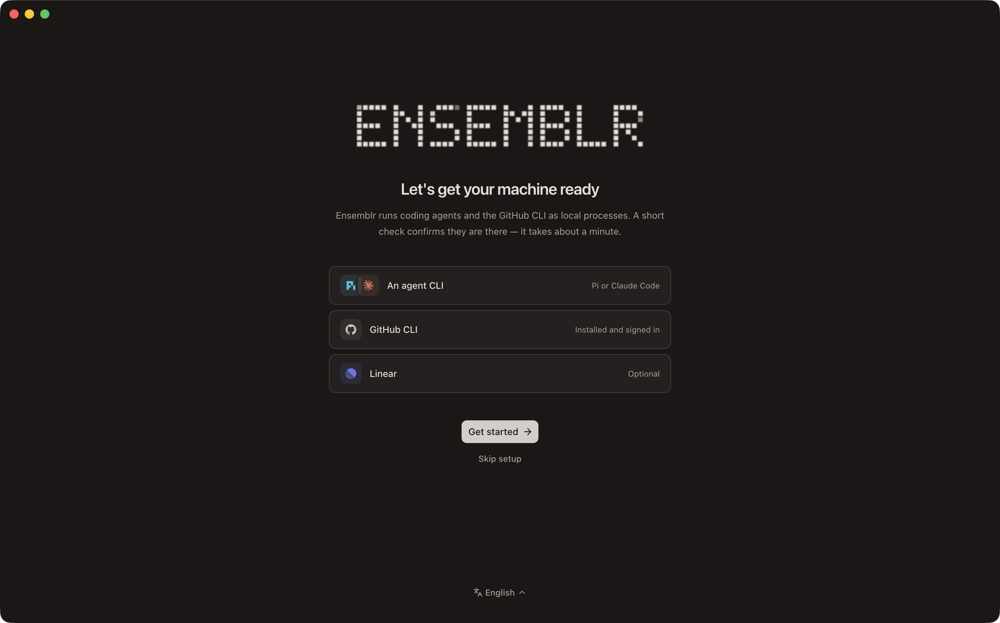
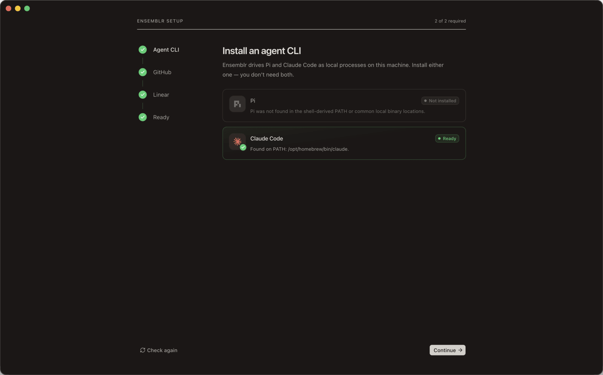
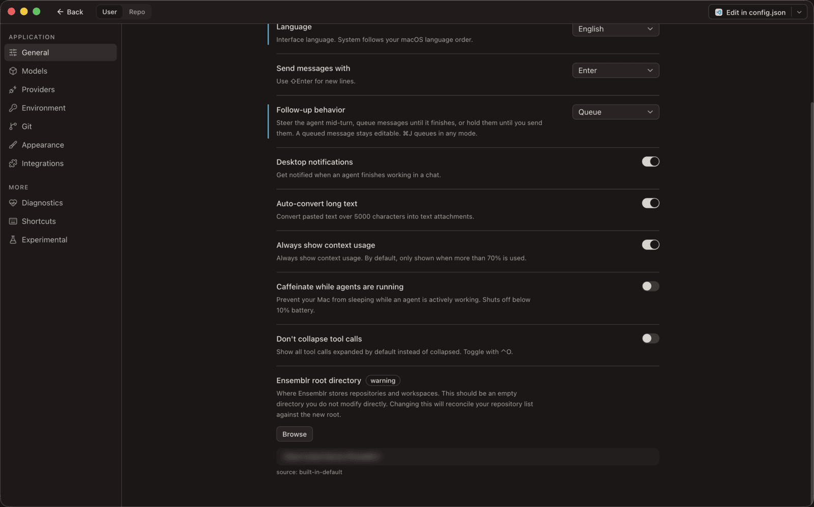
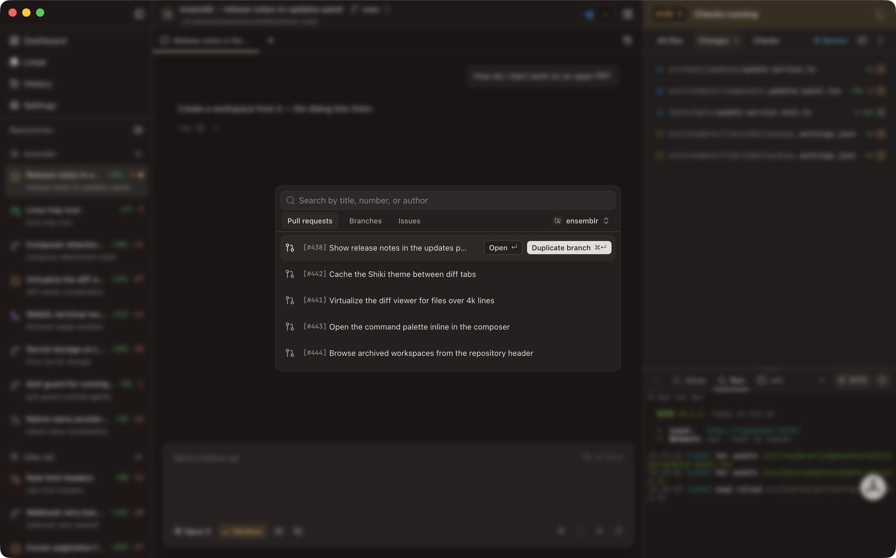

# First run

The first time you launch Ensemblr, the setup wizard opens instead of the
workbench. It claims the window once: as soon as you leave it — by finishing or
by skipping — Ensemblr records that and goes straight to the workbench on every
later launch.

The wizard probes the same setup checks described in
[Requirements](./02-requirements.md). It does not configure anything on your
behalf; it tells you what is missing and hands you the fix.

## The five screens



| Screen | Gates | Required |
| --- | --- | --- |
| **Welcome** | nothing | — |
| **Agent CLI** | `pi-executable` **or** `claude-executable` | yes |
| **GitHub** | `gh-cli` **and** `gh-auth` | yes |
| **Linear** | `linear-oauth` connected | no |
| **Ready** | nothing | — |

Welcome and Ready bookend the three gated steps. They check nothing and never
appear in the progress count in the header, which reads "1 of 2 required" and
counts only Agent CLI and GitHub.

The three gates behave differently, and the difference is deliberate:

- **`any`** — Agent CLI. One passing check is enough. This is what lets a
  machine with only Claude Code, or only Pi, read as ready rather than
  half-broken.
- **`all`** — GitHub. Both checks must pass. Having `gh` installed but not
  signed in is not a partial success; nothing that shells out to it will work.
- **`connected`** — Linear. Stricter than the other two: it demands an outright
  `success`, not the app's looser "usable" bar. Elsewhere in Ensemblr a
  `warning` counts as passing, but `linear-oauth` reports `warning` for "not
  connected" — which the app is content to ignore and the wizard must not draw
  as a finished step.



Each failing check renders as a card with its own fixes. A fix that is a command
is **copied to your clipboard**, never executed — you paste it into a terminal
yourself. A fix that is a URL opens in your browser. A fix that points at a
binary opens the native file picker and re-runs the check afterwards. **Check
again** in the footer re-probes everything.

## Deferring a step

A required step you are not ready to deal with can wait. **I'll do this later**
marks the step deferred and unlocks **Continue**, so a missing `gh` login does
not trap you on screen two.

Deferring is not skipping a requirement — it moves it. The Ready screen lists
everything still unresolved, and **Settings → Diagnostics** carries the full set
from then on. Anything you deferred simply will not work until you come back to
it: with GitHub deferred, Ensemblr still opens and still runs agents, and every
pull-request, review, and merge action fails.

**Skip setup** on the welcome screen leaves the wizard entirely and drops you
into the workbench. You can reopen it at any time from **Settings →
Diagnostics → Setup wizard → Re-run wizard**. Re-running undoes nothing that is
already configured; it re-probes every check and walks you through whatever is
still outstanding.

## The language picker

The welcome screen carries a language picker. Ensemblr ships in three languages:

| | |
| --- | --- |
| `en` | English |
| `ru` | Русский |
| `el` | Ελληνικά |

They are listed under their own names rather than translated, so someone who has
landed in a language they cannot read can still find their own. The setting also
accepts **system**, which follows the operating system's own language preference
and is the default until you pick one.

The choice governs more than the window chrome. It sets the native menu
bar, and it sets the language agents answer in — replies, tab names, workspace
summaries, and review comments all come back in the app's language, because
every agent playbook carries a directive naming it. Switch to Greek and your
agents write Greek.

You can change it later under **Settings → General**.

## The root directory

The wizard does not ask about the root directory. Ensemblr picks one and creates
it: **`~/Ensemblr`**, unless a config file says otherwise.



The root directory is where Ensemblr keeps everything it manages on your behalf.
Inside it, three subdirectories:

```
~/Ensemblr/
├── repos/               # cloned repositories, one folder per project
├── workspaces/          # git worktrees, one folder per workspace
└── archived-contexts/   # handoff files preserved from archived workspaces
```

To use a different location, go to **Settings → General → Ensemblr root
directory**. Changing it reconciles your project list against the new root
rather than moving anything; migration and cleanup are separate, explicit
actions.

**Use a dedicated, empty directory.** Ensemblr treats the root as its own and
tells you when it is not:

- **Unmanaged top-level content** — anything in the root other than the three
  managed directories (and `.DS_Store`) is reported as an error, and Ensemblr
  declines to create its subdirectories there. Pointing the root at your
  existing `~/Projects` folder will fail this way.
- **Shared or previously used root** — if one of the three managed directories
  already has content in it, you get a warning naming which. That is the
  expected state when you re-point Ensemblr at a root it used before, and the
  wrong state when two installs are quietly sharing one.

The path may be absolute or start with `~/`. A relative path is rejected.

## Adding your first project

Past the wizard, the workbench opens on the welcome screen with three ways in:

| Action | What it does |
| --- | --- |
| **Open GitHub project** | Clone a repo from GitHub. Lists your repositories via `gh`, or takes a URL you paste. |
| **Open project** | Point at a git repository already on your disk. Ensemblr clones its tracked files into the managed `repos/` folder — your original is left alone. |
| **Quick start** | Create a new folder, initialize a fresh git repository in it, and publish it to GitHub as a **private** repository via `gh`. |

All three land the project under `repos/` in your root directory and open its
first workspace.

**Quick start can publish into an organization, not just your own account.** The
dialog offers a **GitHub owner** picker listing every account you can create a
repository under; leave it on your personal account or choose an organization,
and the repository is created there. An organization you belong to but cannot
publish into is listed disabled with a short reason — *No access* when your
token cannot reach it at all (SAML SSO, or an enterprise 2FA policy), *Owners
only* when the organization restricts repository creation — so an unavailable
org is visible rather than missing. Ensemblr remembers the last organization you
published into and preselects it, falling back to your personal account if that
access has since been revoked.

The picker hides itself entirely when there is no choice to make — `gh` missing,
unauthenticated, or an account with no organizations — so a solo user's dialog
looks exactly as it did before. Publishing is best-effort: if `gh` fails, you
are warned and the local project still survives.



Opening a local project is not an in-place adoption: Ensemblr copies the tracked
git files into its own managed location, so the folder you selected stays where
it is and is not touched. Large repositories with deep history can take a minute
or two.

## Creating your first workspace

A **workspace** is one isolated stream of work: its own git worktree, its own
branch, its own agent sessions, its own review path. Opening a project creates
the first one for you.

For the next one, the project header offers two paths. **New workspace** cuts a
fresh branch from the default. **Create from…** opens the source picker, which
offers three sources:

| Source | What you get |
| --- | --- |
| **Branches** | A workspace on an existing branch — either taking it over, or duplicating it into a new one. |
| **Pull requests** | A workspace on an open PR's head branch, for reviewing or continuing it. |
| **Issues** | A workspace for a GitHub or Linear issue, with the issue linked to it. |

Each is searchable: branches by name, pull requests by title, number, or author,
issues by number, title, or description.

## What just happened on disk

After cloning one project and creating one workspace, your root looks like this:

```
~/Ensemblr/
├── repos/
│   └── my-project/            # the clone — its own git repository
├── workspaces/
│   └── my-project/
│       └── first-workspace/   # a git worktree of the clone, on its own branch
└── archived-contexts/         # empty until you archive a workspace
```

The workspace is a genuine git worktree of the repository in `repos/`, not a
copy. They share one object store and one history; each has its own working
tree and its own checked-out branch. That is what makes several agents working
in parallel safe — they cannot overwrite each other's files, because they are
not in the same files.

Elsewhere: your project and workspace records land in the SQLite database at
`~/Library/Application Support/dev.ensemblr.app/ensemblr.db`, and your app
settings in `~/.config/ensemblr/config.json`.

## Next

- [Concepts](./04-concepts.md) — projects, workspaces, sessions, base branches,
  and the vocabulary the rest of this guide uses.
- [Agents](./06-agents.md) — running Pi and Claude Code, picking models, and
  Plan Mode.
- [Workspaces](./05-workspaces.md) — the workspace lifecycle in detail.
- [Troubleshooting](./14-troubleshooting.md) — if the wizard will not let you
  through.
