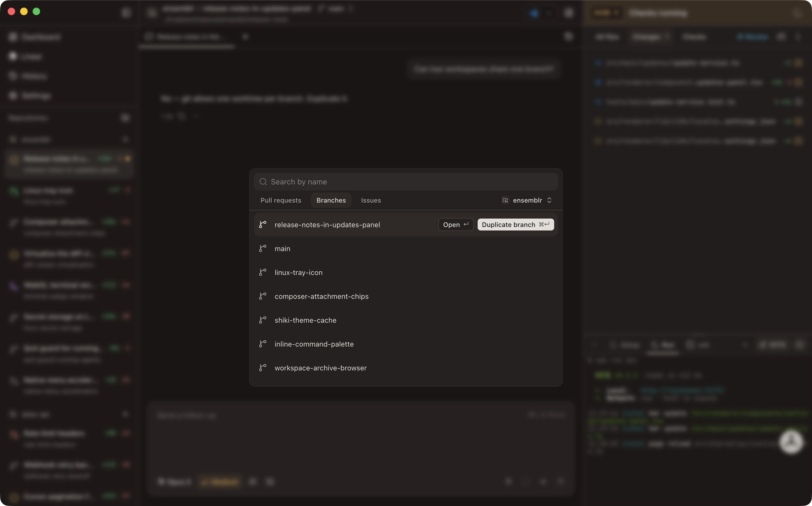
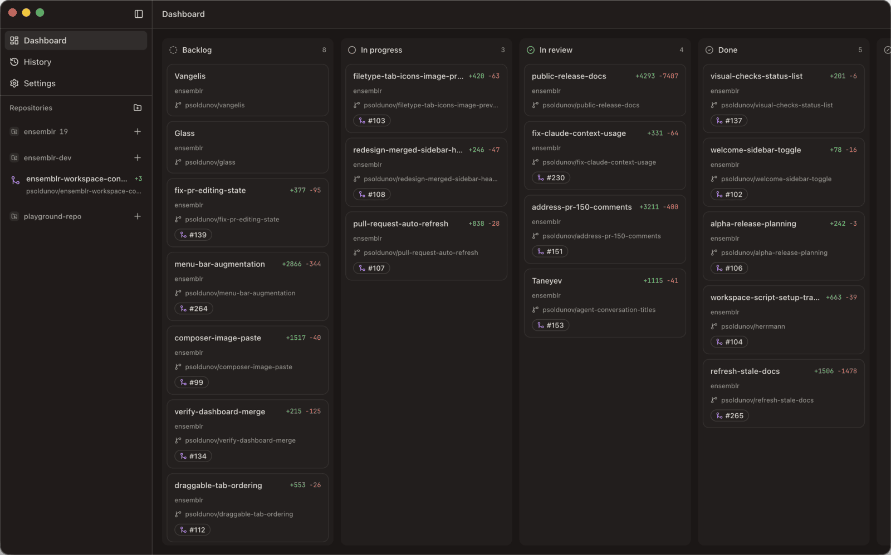

# Workspaces

A workspace is one stream of work: its own git worktree, its own branch, its own
agent sessions and terminals, its own review path. This page follows one from
creation to archive.

If the terms here are unfamiliar, read [`04-concepts.md`](./04-concepts.md)
first — especially the difference between the **base branch** and the branch a
workspace **owns**.

## Creating a workspace

The create dialog offers three tabs. Each lists things you can start work from:

| Tab | Source | What the workspace does with the branch |
| --- | --- | --- |
| **Pull requests** | open pull requests on the project | takes over the PR's head branch |
| **Branches** | local and remote branches | takes over that branch |
| **Issues** | GitHub issues and Linear issues | cuts a fresh branch — an issue has none yet |

The row's action button tells you which it will be: **Use branch** takes one
over, **Create** cuts a new one. The project's default branch is the exception on
the Branches tab — it always creates, because the project folder already has it
checked out and because "start something new off `main`" is what picking it
means.

A branch or PR head another active workspace already holds offers **Open** and
**Duplicate branch** instead. Git allows a branch in one worktree at a time, so
taking it over twice would only fail.

Before the worktree is made, Ensemblr fetches the base branch and fast-forwards
your local copy of it, so a new branch starts from current work rather than from
whatever you last pulled. This is **best effort**. Offline, no upstream
configured, a diverged base, a dirty tree, the base checked out in another
worktree — every one of those is skipped silently and creation proceeds from the
local base you already have. You can create workspaces on a plane.

## Adopt or cut, and what follows from it

The choice above has consequences for the rest of the workspace's life:

| | Adopted branch | Cut branch |
| --- | --- | --- |
| Name | keeps its own | generated (below) |
| Commits | join that branch's history | start a new one |
| Pushing | lands on whatever pull request already tracks the branch | needs a new pull request |
| On archive | **never** deleted — the workspace did not create it | deleted when **Delete branch on archive** is on |

See [ADR 0043](../adr/0043-adopt-an-existing-branch-instead-of-always-forking.md)
for the full reasoning.

## Branch naming

A workspace that **cuts** a branch does not get its final name at creation. It
starts on a placeholder, and after your first agent turn the branch is renamed
from what you actually asked for: a kebab-case slug, lower-cased, capped at 40
characters at a word boundary. "Add a dark mode toggle to the settings page"
becomes `add-dark-mode-toggle-to-the-settings`.

A prefix is prepended when one is configured:

| Source | Behaviour |
| --- | --- |
| `[git] branch_prefix` in `.ensemblr/settings.toml` | always wins — it is the team's shared choice |
| **GitHub username** (app default) | your `gh` login, e.g. `yourname/add-dark-mode` |
| **Custom** | a literal prefix you type |
| **None** | no prefix |

Two limits worth knowing. Automatic naming only applies while the workspace still
carries its generated placeholder name — once you rename it, the name is yours
and nothing overwrites it. And it only applies to a branch the workspace **cut**;
an adopted branch keeps the name it arrived with.

**A plan-mode workspace is named before the agent gets there.** A planning
interview can run for a long time before the agent has anything worth naming the
work after, which used to leave a placeholder sitting on the board for the whole
of it. Ensemblr now derives a **provisional** name from your opening prompt the
moment a plan-mode session starts, with no model in the loop, so the board reads
correctly within a second. The guess is explicitly marked provisional: the
agent's own naming call still counts as the first real naming and replaces it for
free. Rename the workspace yourself at any point and both stop.

## Copying files into a new workspace

A fresh worktree has no gitignored files — no `.env`, no local credentials. Since
those are exactly what a dev server needs, Ensemblr copies a declared set of them
in at creation. It asks git which gitignored files match your patterns, so
nothing tracked and nothing unmatched is touched.

The pattern list comes from the first of these that declares one:

1. `.worktreeinclude` in the project root — a legacy one-path-per-line list, still read
2. `file_include_globs` in `.ensemblr/settings.toml` — the committed, shared choice
3. your personal patterns, set in the app
4. the built-in default, `.env*`

Committed config outranks a personal override deliberately: a team that has
agreed on a list gets that list.

## Setup scripts on creation

If the project declares `[scripts] setup`, it runs when the workspace opens —
`npm install`, `bundle install`, whatever gets the tree ready.

It does not run every time. Ensemblr fingerprints the resolved setup command
together with the contents of every dependency lockfile it finds (npm, yarn,
pnpm, bun, Cargo, poetry, Go, Bundler, Composer and peers), and skips the run
when the fingerprint has not moved. Reopening an untouched workspace costs
nothing.

The fingerprint tracks **declared** dependencies, not installed state. Deleting
`node_modules` without touching a lockfile will not re-trigger setup — reinstall
explicitly. See
[ADR 0034](../adr/0034-skip-unchanged-workspace-setup-runs.md).

Set `auto_run_after_setup = true` under `[scripts]` and a successful setup (exit
code 0) chains straight into the project's default run script, so a new workspace
comes up with its dev server already running.

Both are covered in [`07-terminals-and-run-scripts.md`](./07-terminals-and-run-scripts.md)
and [`12-repository-settings.md`](./12-repository-settings.md).

## The board

Every workspace is a card in one of five columns: **Backlog**, **In Progress**,
**In Review**, **Done**, **Canceled**. Drag a card to move it between columns or
to reorder within one — the order you set is kept. Each card has an action menu
for the things you do to a whole workspace without opening it.

Agents can move their own workspace across the board too, which is how a
delegated run reports itself finished without interrupting you. Note that what an
agent may *not* do is close out the **Linear** issue behind the work: an update
targeting a completed or canceled state is refused, so agent work goes as far as
In Review and you decide whether it is done. See
[`09-agent-control.md`](./09-agent-control.md).

### Work that has no workspace yet

Backlog holds more than workspaces. It also carries **tracker issues nothing has
been started from** — unstarted Linear issues from every connected account, and
open GitHub issues nobody is assigned to. An issue card is not a workspace;
**dragging one rightward is what creates the workspace from it**, with the same
naming, branch, and seeded prompt the Issues tab of the create dialog produces.

Nothing on the board is ever written back to Linear or GitHub. Dropping an issue
on **Canceled** dismisses it here and nowhere else — the issue's own status in
the tracker stays yours to change.

The toolbar above the board carries search, repository and source facets, three
sort orders, and a manual refresh. GitHub issues are cached locally, so the
board paints at app start rather than waiting on a call per repository; when a
refresh fails and the cache stands in, the rows are real but old and the board
tells you so. Refresh always goes to the network — it is the button you press
precisely when the cached rows are the problem, so it is not allowed to answer
from the cache — and it stays spinning until every repository has finished,
whether or not one of them failed.

Because the backlog fans one `gh issue list` across every repository, it reports
failures **per repository** rather than showing the first one and going quiet:
one banner per distinct failure, with the repositories that failed the same way
folded into a single row. A repository with issues switched off on GitHub is not
a failure at all — it has no issues, so it contributes nothing to the backlog and
raises nothing.

## Retargeting the base branch

The base branch is the merge target and nothing else, so changing it is cheap.
Pick a different target and Ensemblr updates the stored base — the worktree, your
branch, and your commits are not touched. What follows the new target is the
diff, the merge-conflict check, and the branch a pull request would open into.

Conflicts are reported against the base: if the base moves ahead of you in a way
your branch cannot merge cleanly, the workspace says so and points at the files.
Resolving them is part of the review flow —
[`08-reviewing-changes.md`](./08-reviewing-changes.md).

## Continuing finished work

When a workspace's pull request has merged and you want to keep going in the same
place, **continue** it. Ensemblr branches onto a numbered successor — `bach`
becomes `bach-v2`, `bach-v2` becomes `bach-v3` — forking from the base branch and
checking the new branch out. A name already taken is skipped, so a repeat
continue never collides with a branch an earlier one left behind.

Three things to expect:

- Uncommitted work carries over untouched.
- The merged branch stays exactly where it is, so the old pull request keeps its
  history; the workspace simply stops resolving to it.
- If the base branch could not be resolved, the successor forks from your current
  HEAD instead and the result carries a warning saying so.

## Archiving and history

Archiving is not deleting. When you archive a workspace, its `.context/` folder —
the handoff notes, plans, and attachments accumulated during the work — is copied
into the Ensemblr root's `archived-contexts/` directory alongside a metadata
record. The directory is stamped with the workspace and a timestamp and is never
reused; archiving the same workspace twice is refused rather than overwriting.

From the History screen you can browse everything archived for a project,
**restore** one (which brings back its `.context/`, recreating the worktree first
if the archive removed it), or **permanently delete** it — which purges the
preserved directory, the worktree and branch if still present, and the record.

The same line separates what the app *remembers* about a workspace — its board
column, whether it is pinned, which chat tab and terminal you had open, which run
script you last used. **Archiving keeps all of it**, because a restored workspace
should come back as you left it. **Deleting clears it**, so a machine that has
opened hundreds of workspaces is not carrying a remembered tab for every one of
them. Each workspace's memory is its own: switching between two of them and back
lands you on the chat you were reading, not on whichever one you looked at last.

### The worktree folder is reclaimed

A worktree directory is overwhelmingly gitignored dependencies and build output
that the setup script rebuilds, so a user who has been archiving for months would
otherwise be holding tens of gigabytes for workspaces they finished with.
Archiving therefore removes the directory and keeps the branch, and unarchiving
re-derives the workspace from git rather than finding it in place. There is no
setting and no separate action: it is what archiving does. The success toast
reports how much disk it gave back.

What git cannot store is captured before anything is removed. Uncommitted and
untracked work goes into a snapshot commit under `refs/ensemblr/archived/<id>`
whose parent is the branch tip, so that one ref pins both the working tree and
the branch history against `git gc` even if the branch is later deleted outside
the app. The **Files to copy** matches are gitignored by definition and therefore
absent from that snapshot, so they are preserved into the archive directory
separately. **Either capture failing aborts the removal** — refusing to reclaim
disk beats reclaiming work.

Unarchiving reverses it: the branch is checked out at the original path, the
snapshot is restored on top and left unstaged, the preserved **Files to copy**
matches are copied back, and the setup marker is cleared so the next open
rebuilds dependencies. A worktree that went missing without a record — a folder
deleted by hand, or a stamp that failed — is recovered from its branch instead of
being reported as an orphaned row.

An archive made before this was unconditional may still have its folder on disk.
Nothing reclaims it retroactively — **Delete permanently** in the archive browser
is what clears one out.

### The git side

Two settings under `[git]` govern it:

| Setting | Default | Effect |
| --- | --- | --- |
| `delete_local_branch_on_archive` | off | also delete the workspace's local branch when archiving |
| `archive_after_merge` | off | archive the workspace automatically once its pull request merges |

`delete_local_branch_on_archive` is the **only** control over branch cleanup —
the archive dialog carries no checkbox of its own, and archiving by hand does
what merging then archiving does. It is resolved against the worktree being
archived rather than the repository root, so two workspaces of one repository
can answer differently if their committed `.ensemblr/settings.toml` differ. The
dialog says which of the two it is about to do before you press Archive, and
says the branch is being kept if the setting could not be read at all.

A branch the workspace **adopted** is never deleted regardless — it was not the
workspace's to destroy.

`delete_local_branch_on_archive` takes the directory with it either way, but by
a different route: it destroys the commits deliberately, which is the opposite
guarantee to the snapshot an ordinary archive keeps — so it skips the snapshot
rather than writing one nothing would ever restore.
See [ADR 0027](../adr/0027-use-workspace-archive-lifecycle.md).

## Opening a workspace elsewhere

A workspace is a normal directory on disk, and the workbench header has an
"Open in…" menu for handing it to another app: Finder, your editor, a terminal,
a source-control GUI.

Only apps you actually have installed appear, and each entry knows how to be
launched on the platform you are on: macOS detects them through Launch Services,
Linux resolves either a launcher command on `PATH` or a `.desktop` entry and
spawns it detached. Either way the menu shows their real icons and never offers
you something that would fail to open. ⌘O opens your primary editor, ⌘⇧C copies the
path, and `1`–`9` pick entries while the menu is open. See
[ADR 0028](../adr/0028-use-launch-services-for-open-workspace-in-app.md).

## See also

- [`06-agents.md`](./06-agents.md) — working in a workspace with an agent.
- [`08-reviewing-changes.md`](./08-reviewing-changes.md) — the review flow.
- [`12-repository-settings.md`](./12-repository-settings.md) — everything in `.ensemblr/settings.toml`.
- [`14-troubleshooting.md`](./14-troubleshooting.md) — when creation or archive fails.
