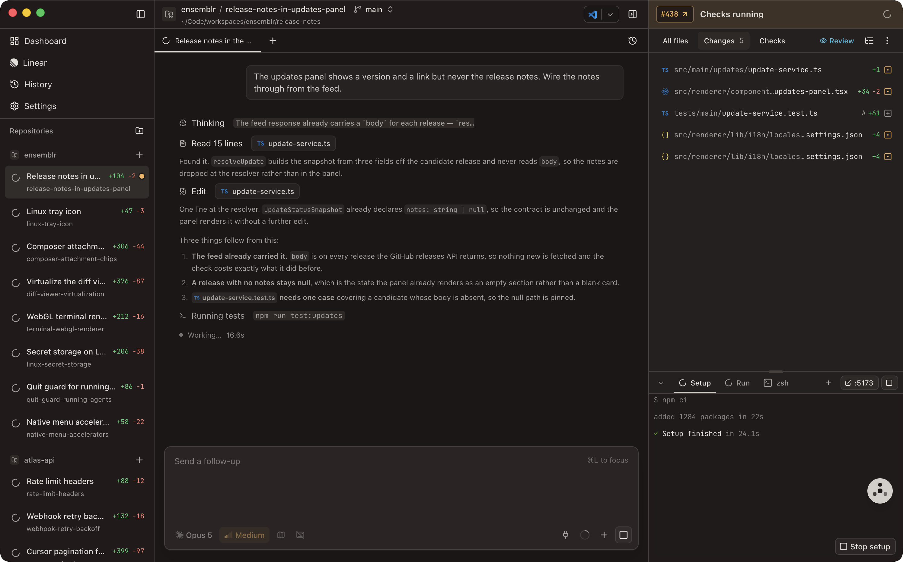
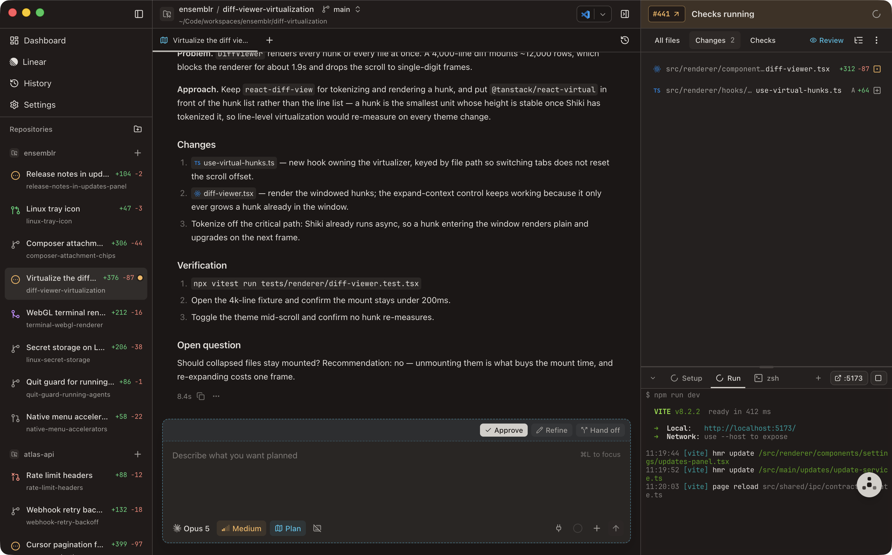

# Agents

Ensemblr drives two coding agents natively in chat tabs: **Pi** and **Claude
Code**. This page covers what they share, where they differ, and everything you
control from the composer.

Third-party CLIs — Codex, Vibe, and Claude Code's own terminal UI — run alongside
them as harnesses in terminal tabs. Those are covered in
[`07-terminals-and-run-scripts.md`](./07-terminals-and-run-scripts.md) and
[`../harnesses.md`](../harnesses.md).

## Two runtimes, one chat surface

Both runtimes drive the same chat: the same streaming timeline, the same tool
cards, the same checkpoints, the same permission model, the same Ensemblr Control
tools. You pick the runtime by picking a model, and once the conversation has a
session it is **pinned** to that runtime for the rest of its life. Models
belonging to the other runtime stay visible in the picker but are disabled — to
switch, start a new chat.

One known difference in the timeline: Pi streams partial tool output, so a long
`bash` fills its tool card as it runs. Claude Code returns each tool result
complete, so its cards show a spinner until the result lands.

See [ADR 0042](../adr/0042-add-claude-code-as-a-second-first-class-agent-runtime.md).

## The `ensemblr` skill

Every agent Ensemblr starts is handed a skill describing the app it is running
in — the workspace and worktree model, the `ensemblr_*` control tools, and the
full `.ensemblr/settings.toml` key reference. It loads on demand, so it costs the
conversation almost nothing until a task actually needs it, and you can call it
up yourself with `/skill:ensemblr` in a Pi chat or `/ensemblr:ensemblr` in a
Claude one.

It ships inside the app. Nothing is written into your repository or into your
`~/.claude` and `~/.pi` directories, so it never appears in a workspace diff and
never follows you into a `pi` or `claude` session you start yourself. Terminal
harnesses get it too, where the harness supports skills — the `claude` TUI does;
Codex and Vibe do not.

## Pi

Ensemblr spawns **your** `pi` binary in RPC mode and talks to it over stdio. Your
existing Pi setup comes with it — credentials, model configuration, packages,
extensions, skills, prompt templates, themes, context files.

## Claude Code

Ensemblr drives Claude Code through the Claude Agent SDK against **your own**
`claude` binary. **Ensemblr ships none.** If you have no `claude` installed, the
Providers settings tab reports it and you cannot open a Claude chat until you
resolve it — an honest failure rather than a silent fallback.

To get set up:

- Install the `claude` CLI.
- Sign in: run `claude` and complete the login prompt (or `/login` from inside a
  session).
- Your Claude settings stay where they always were, in `~/.claude/settings.json`.
  Ensemblr does not manage them.

Ensemblr resolves which `claude` to run from the override on the Providers page
first, then your shell `PATH`. What that page reports is what actually runs.

Four things are discovered **live from the installed CLI** rather than baked into
Ensemblr, so they track whatever version you have and whatever your account is
entitled to:

| Discovered | Notes |
| --- | --- |
| Slash commands | read against the workspace, so project commands show up |
| MCP server roster | your configured servers, as the CLI sees them |
| Model catalogue | an account fact, so read without a workspace |
| Thinking levels | each model carries the effort levels it supports |

All four are deferred until something asks for them, so opening the app spawns
nothing. [`../claude/README.md`](../claude/README.md) has the details.

### Plan usage and session cost

Claude Code reports what your account has spent against its claude.ai plan, and
two surfaces show it.

- **Settings → Providers** draws a bar per rate-limit window, read once per
  readiness probe. It runs on its own short deadline, so a slow usage endpoint
  costs that panel alone and never the rest of the page.
- **The composer's context hover card** carries the same windows for this chat's
  own session, plus a running cost estimate. "How much room is left" is one
  question over two horizons, so it is one control rather than two gauges
  competing on the same row.

Both readings persist like any other event, so reopening a chat replays its
gauges instead of blanking them until the next turn. A crashed turn that reports
a zero cost is dropped rather than walked backwards, and a live reading layers
over the replayed one rather than replacing it.

Plan usage is a Claude Code fact and appears only on Claude chats.

## Choosing a model and reasoning level

The composer's model picker groups models by their inference provider — the
vendor serving them, such as Anthropic or OpenAI. That is a separate axis from
the agent runtime: which runtime a model belongs to is what pins the session.

Reasoning is steered differently by each runtime, and the two scales are never
merged:

| Runtime | Control | Levels |
| --- | --- | --- |
| Pi | **thinking** | `off` through `xhigh` — six levels |
| Claude Code | **effort** | `low`, `medium`, `high`, `xhigh`, `max`, per what the model supports |

Like the runtime, the level pins to the session.

The context gauge next to the picker shows how much of the model's window the
conversation currently occupies.

## Permission modes

What an agent may do inside its workspace is a **per-project** setting, under
Settings → Repo → Security. It applies to the agent's own tools and to its
Ensemblr Control calls alike.

| Mode | Reads | Workspace writes, shell, scripts, terminals |
| --- | --- | --- |
| **Workspace trusted** (default) | allowed | run automatically |
| **Approval required** | allowed | pause and ask you |
| **Read only** | allowed | blocked |

Reads, searches, and listings are allowed in every mode. Separately, a set of
actions whose blast radius reaches past the workspace **always** asks for
confirmation, whatever the mode:

- changing app settings
- writing outside the workspace
- changing Pi's global configuration
- merging a pull request
- removing a project
- changing the Ensemblr root directory
- permanently deleting an archived workspace

One asymmetry to know about: the two stricter modes are enforced at the runtime
for **Claude Code**, which exposes the hooks to do it. **Pi keeps unrestricted
workspace control** — its CLI takes no permission flag — so with Pi the mode
still gates Ensemblr Control and the app's own channels, but not Pi's own file
and shell tools. The workspace's git worktree is the isolation boundary either
way.

## Tool approvals

Under **Approval required**, a Claude Code chat replaces the composer with an
approval card the moment a tool wants to run. It names the tool and its
arguments, and offers three answers:

| Answer | Effect |
| --- | --- |
| **Allow** | this call only |
| **Allow for this session** | this tool, for the rest of this session |
| **Deny** | refuse the call |

"Allow for this session" is held in memory only — never written to disk, never
shared with another session. Prompts are shown one at a time even when a single
assistant message fires several tool calls in parallel. If the session stops, the
chat closes, or you quit, any outstanding card is withdrawn rather than left
hanging.

## Plan mode

Toggle plan mode (⌥⇧P) and the agent is held to planning. It keeps its read-only
tools; writing, editing, and any `bash` command that is not read-only are
refused, as are the tools that would hand the work to something else — starting a
conversation, launching a harness, opening a terminal.

When it is ready it submits a plan. Ensemblr writes the plan to a file under the
workspace's `.context/plans/`, posts it into the chat, and raises a review panel
where you approve it or send it back for refinement.

Three properties make this a mode rather than a polite request:

- **It is enforced per tool call**, at the control channel, not by an instruction
  in the prompt. A model cannot decide the instruction has been superseded, and a
  compaction cannot drop it.
- **It fails closed.** A tool call the classifier cannot confidently clear is
  refused, not allowed.
- **Sub-agents inherit it.** A planning agent that fans out investigators gets
  planning investigators — none of them can edit the repository either.

Sending a plan back for refinement reminds the agent to **resubmit** when it is
done. Without that, a refine turn reads as ordinary conversation and the agent
answers in prose instead of putting the revised plan back through the panel.

Claude Code uses its own native plan mode; Ensemblr routes the result into the
same review path, so both runtimes save to the same place and raise the same
panel. See
[ADR 0044](../adr/0044-enforce-plan-mode-fail-closed-at-the-control-channel.md).

A plan-mode workspace is also named from your opening prompt before the agent
gets there, and marked provisional so the agent's own naming call still replaces
it ([ADR 0050](../adr/0050-name-a-planning-workspace-before-the-agent-does.md)).

## Checkpoints and session branching

Before each of your prompts runs, Ensemblr captures the workspace's file state
into a private git ref tied to that turn. Restoring a checkpoint reverts the
files to how they were at that boundary and hides the messages after it.

The conversation history itself is not destroyed by a restore — the runtime's own
session record stays intact. Checkpoints are about **files**; **session
branching** is about the conversation, letting you fork from an earlier point and
try a different direction while keeping what came after.

Because Ensemblr's checkpoints are git-backed and wrap turns, the Claude SDK's
own file checkpointing is deliberately left off — two checkpoint systems over one
worktree would fight. See
[ADR 0012](../adr/0012-use-git-backed-checkpoints-for-pi-turns.md).

## Composer attachments

Anything you pin into a message becomes a chip sitting inline in your sentence:

| Attachment | How you add it |
| --- | --- |
| A workspace file | `@`-mention it, drop it in, or **Attach to chat** from the Files tree |
| A folder | **Attach to chat** from the Files tree |
| A file's diff | **Attach diff to chat** from the Changes list |
| A pasted image | paste |
| A long pasted text block | paste — converted to an attachment rather than flooding the box |
| A Linear or GitHub issue | the issue picker |
| A review-comment thread | from the Changes panel |

They form **one ordered list**, and the outgoing prompt carries each one at the
position its chip sat in your sentence. "Compare this screenshot against this
file" arrives with both in place, so the agent does not have to re-derive which
was which.

Payloads are written to disk under the workspace's `.context/attachments/` at the
moment you attach them, keyed by content — so an attachment has a real path the
agent can re-read, and the same file attached twice is stored once. A referenced
thing is written out as a document rather than summarised into a line of prose.

A **file or folder is attached by reference**: the chip carries the path, and the
agent opens it itself. A **diff has no file of its own**, so its patch is written
out as a markdown document and the chip points at that — a thousand-line rewrite
becomes one chip rather than burying your question under its own diff. Because
the store is keyed by content, re-attaching a file after the agent has touched it
lands a *fresh* chip instead of being folded into the stale one.

A workspace created from a tracker issue opens with that issue **already
attached** as a document, once per chat, rather than with a summary flattened
into the draft box — so the agent reads the body and the comments instead of
whatever survived truncation. Remove the chip and it stays removed.

See [ADR 0047](../adr/0047-model-composer-attachments-as-one-ordered-list-in-a-lexical-draft.md).

## Linked directories

To let an agent read something outside its workspace — a sibling repository, a
design folder — link the directory. This is a **grant**, not an attachment:
nothing is copied and nothing is serialized, the agent is simply allowed to read
there. The grant is held per chat and sticks across sends.

Two deliberate behaviours:

- **Symlinks are not resolved.** The path you picked is the path that is granted.
- **A directory linked mid-session is pending** until the chat reopens, and the
  composer says so. The runtime takes its roots at launch, so the honest answer
  is to tell you rather than let the agent hit an unexplained denial.

## The follow-up queue and unread marks

Type while a turn is running and your message joins the **follow-up queue**
instead of disappearing. Queued messages stay listed, and you can reorder, edit,
or remove them right up until they drain.

An **unread mark** appears on a chat where agent activity landed while you were
elsewhere. Marks are per chat, not per workspace, so reading one tab does not
clear its siblings — a workspace with three agents running keeps three separate
answers to "is there anything new here". You can also mark a workspace unread
yourself.

A mark is retired when its chat is **read** or when its tab **closes** — whether
you closed it or the agent did. A chat an agent opened, used, and closed before
anyone looked at it therefore leaves no dot pointing at a tab that is no longer
there.

## Notifications and language

Desktop notifications are on by default and can be turned off in app settings.
They are **per chat, not per app**: a chat that finishes a turn or stops to ask
you something posts its own notification, titled with that chat's name and
naming its workspace in the body, so a fan-out of agents produces one line per
agent rather than one line for the window. Clicking a notification brings
Ensemblr forward and opens the chat it came from.

A **notification sound** rides alongside, on by default and switchable
separately — the chat can chime without the notification banner, or the other
way round. There is also an option to keep the Mac awake while an agent is
running, so a long turn is not cut short by sleep.

## Quitting with agents still running

Quitting while any chat is mid-turn raises a native confirmation first, naming
the chats that are about to be interrupted. **Quit Anyway** goes through and
stops them; **Cancel** leaves everything running. Nothing is quietly killed, and
nothing blocks a quit you meant.

Agents write back in the language the app is set to — replies, tab titles,
workspace summaries, review comments, and the questions they put to you. Code,
identifiers, file paths, shell commands, commit messages, and branch names stay
exactly as they are. English is the default and the fallback; setting the app to
English does not force an agent to answer in English when you write to it in
something else.

## See also

- [`09-agent-control.md`](./09-agent-control.md) — what an agent can drive in the app.
- [`08-reviewing-changes.md`](./08-reviewing-changes.md) — reviewing what an agent produced.
- [`11-app-settings.md`](./11-app-settings.md) — notifications, language, providers.
- [`13-keyboard-shortcuts.md`](./13-keyboard-shortcuts.md) — composer and chat shortcuts.
