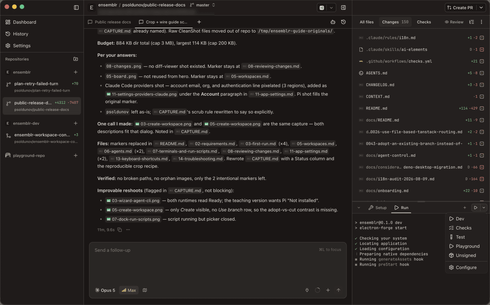

# Terminals and Run Scripts

Every workspace has a terminal **dock** along the bottom of the workbench. It
holds the workspace's setup output, its run scripts, and any interactive shells
you open — one tab each. Collapse the dock when you need the room; Ensemblr
remembers which dock tab you were on for each workspace separately.

The dock renders real PTYs — xterm.js over `node-pty`
([ADR 0002](../adr/0002-xterm-terminal-renderer.md)) — so `vim`, `less`, a
progress spinner, and a full-screen TUI behave the way they do in your own
terminal.

## Three kinds of tab

| Tab | What it runs | Your input | Re-offered after a restart |
| --- | --- | --- | --- |
| **Setup** | the repository's setup command | read-only | no |
| **Run** | one of the repository's named run scripts | read-only | no |
| **Terminal** | your login shell, in the worktree | interactive | yes |

Script output panes are **read-only**: they show what the command printed, and
nothing you type reaches the process. To change what a script is doing, stop it
from its tab and start it again.

Interactive terminals are the only kind Ensemblr brings back after a restart. A
tab that was open when you quit reopens with its previous scrollback replayed
above a dim `── restored session — output above is from the previous run ──`
divider, and a fresh shell below it. Script runs are transient and are never
re-offered; agent harness tabs resume through their own path instead, described
in [`../harnesses.md`](../harnesses.md).

Open a new interactive terminal from the **+** in the dock's tab strip.

The dock is not the only place a terminal can live — a coding-agent CLI launched
as a harness opens its own terminal tab in the chat tab strip instead. See
[Running a coding-agent CLI in a terminal](#running-a-coding-agent-cli-in-a-terminal).

## The environment inside a workspace terminal

An **interactive terminal** starts your login shell — read from your macOS user
record, so it is the same `fish`, `zsh`, or `bash` you get from Terminal.app,
with your own config and your own `PATH`.

**Script commands do not.** Setup, run, and archive commands run under a POSIX
shell (`/bin/zsh`, `/bin/bash`, or `/bin/sh`), because repository scripts
routinely use `VAR=value command` and similar constructs that fish rejects. A
fish-only construct in a run script will fail even though the same line works in
your interactive tab.

Because a script shell does not source your shell config, Ensemblr resolves the
workspace directory's version-manager-aware `PATH` (the one your login shell
would produce there, honouring `.nvmrc`, `mise.toml`, and peers) and hands it to
script processes. If you set `PATH` yourself as an environment variable, your
value wins.

On top of that, every workspace process gets the environment variables you
configured in **Settings → Environment** and in the repository's own Environment
section — see [`./11-app-settings.md`](./11-app-settings.md) and
[`./12-repository-settings.md`](./12-repository-settings.md).

### Reserved variables

Five variables are populated by Ensemblr for every workspace process. They are
**reserved**: trying to set one yourself in Environment settings is rejected,
because the runtime overwrites it anyway.

| Variable | Value |
| --- | --- |
| `ENSEMBLR_WORKSPACE_NAME` | the workspace's name |
| `ENSEMBLR_WORKSPACE_PATH` | absolute path to the workspace worktree |
| `ENSEMBLR_ROOT_PATH` | absolute path to your Ensemblr root directory |
| `ENSEMBLR_DEFAULT_BRANCH` | the workspace's base branch |
| `ENSEMBLR_PORT` | a port reserved for this workspace |

`ENSEMBLR_PORT` is the one worth designing your scripts around. Each workspace
is allocated one port from a dedicated range (41000–41999), chosen
deterministically from the workspace id and persisted, so it stays the same
across restarts and never collides with a sibling workspace running the same dev
server. A run script written as `PORT=$ENSEMBLR_PORT npm run dev` lets four
workspaces of one repository serve at once.

`ENSEMBLR_DEFAULT_BRANCH` is the only one that can be missing: if no base branch
and no repository default branch is recorded, it is left unset and the workspace
reports a diagnostic rather than guessing.

## Run scripts

A repository declares any number of **run scripts**, each under
`[scripts.run.<name>]` in `.ensemblr/settings.toml`. The dock's Run button
offers them by name, and **⌘R** starts the default one. (⌘R is why the app has
no reload shortcut — the accelerator is spent here.)

| Field | Effect |
| --- | --- |
| `command` | the command to run. The only required field; a script without one is dropped. |
| `default` | marks the script ⌘R and the Run button start with no further choice. At most one script may claim it. |
| `icon` | the icon in the picker, from a fixed set of names. An unrecognised name falls back to `play`. |
| `available_in` | environments the script is offered in. `local` is the only one Ensemblr runs today, so a script that excludes it is hidden rather than offered and failed. |

If no script is flagged `default`, the first declared one is treated as the
default. A script name is displayed as a label — `dev-server` shows as
`Dev server`.

Only one run script runs per workspace at a time. Starting a second is refused
unless you asked for a restart, in which case the running one is stopped first.

For the exact TOML syntax and the full icon list, see
[`./12-repository-settings.md`](./12-repository-settings.md).

### Concurrency across workspaces

`run_mode` under `[scripts]` decides whether sibling workspaces of the same
repository may run their run scripts at the same time.

| `run_mode` | Behaviour |
| --- | --- |
| `concurrent` (default) | every workspace may hold its own run script at once |
| `nonconcurrent` | starting a run script stops the run scripts in the repository's *other* workspaces first |

Any value other than `nonconcurrent` is read as `concurrent`. `nonconcurrent` is
for the case where the dev server binds a fixed port or a shared resource and
only one workspace can hold it; stopping siblings is best-effort, so a sibling
that ignores the signal is left behind rather than blocking your launch.

## Setup and archive scripts

Setup and archive are single commands rather than named lists — `setup` and
`archive` under `[scripts]`.

**Setup** runs when a workspace opens, so dependencies are installed before you
or an agent start work. It does not re-run on every open: Ensemblr fingerprints
the resolved setup command together with the contents of every dependency
lockfile in the worktree, and skips the run when that fingerprint is unchanged
([ADR 0034](../adr/0034-skip-unchanged-workspace-setup-runs.md)). The
fingerprint tracks *declared* dependencies, not installed ones — deleting
`node_modules` without touching a lockfile does not re-trigger setup, so a
reinstall in that situation has to be explicit.

Set `auto_run_after_setup = true` to start the default run script as soon as
setup exits 0.

**Archive** runs as part of archiving the workspace, before the workspace's
`.context/` handoff files are preserved. See
[`./08-reviewing-changes.md`](./08-reviewing-changes.md) for when archiving is
the right end to a piece of work.

## Editing scripts from inside the app

The repository's **Scripts** settings pane reads and writes
`.ensemblr/settings.toml` directly — it is the only store for script settings
([ADR 0041](../adr/0041-write-repository-scripts-to-ensemblr-settings-toml.md)).
Three consequences are worth knowing before you save:

- **Saving rewrites the file, and comments are not preserved.** Every other
  section survives by value, but hand-written comments and blank-line grouping
  are lost on the first save. A repository whose Scripts pane you never open
  keeps its file untouched.
- **A file that does not parse is never overwritten.** The save fails with an
  error and your file is left byte-for-byte intact.
- **Edits land on the repository root clone, not the open workspace.** That is
  the checkout whose branch you commit and merge, so the change is one your team
  can actually receive — commit `.ensemblr/settings.toml` to share it. A
  workspace picks it up once its own branch has the change, and if the open
  workspace's branch resolves different script settings, the Scripts pane says
  so.

## Running a coding-agent CLI in a terminal

Besides the native chat tabs, you can launch a third-party coding-agent CLI —
Claude Code, OpenAI Codex, or Mistral Vibe — as a **harness**. The **Launch
coding agent** button in the chat tab strip (**⌘⇧A**) lists the ones you have
installed; picking one, by click or by its number key, opens it as a terminal tab
there and focuses it. Each runs as its native TUI, resumes the exact conversation
it was on after a restart, and gets the `ensemblr_*` control tools over MCP.

A harness only appears in that list when its binary is on your `PATH`, and you
install and authenticate each one from its own vendor — Ensemblr manages none of
those credentials. Every harness launches with its own "skip permission prompts"
flag so it can work in a PTY, which is why the workspace's git worktree is the
isolation boundary you should be relying on.

[`../harnesses.md`](../harnesses.md) has the full picture: the flag each harness
gets, how resume works per tool, and why the harness `claude` tab is a different
thing from a native Claude chat tab.

## Fonts and scrollback

The dock ships with **JetBrains Mono Nerd Font**, bundled, so Nerd Font glyphs
in a prompt or a TUI render without you installing anything. **Settings →
Appearance** carries the terminal font, the terminal font size, and the mono
font used for code and diffs — to override a font, type its name exactly as
installed on your system.

The same section sets the terminal scrollback limit, which bounds how much
history each pane keeps. Larger values cost memory.

## See also

- [`./12-repository-settings.md`](./12-repository-settings.md) — the
  `.ensemblr/settings.toml` reference.
- [`../harnesses.md`](../harnesses.md) — the harness registry, flags, and resume.
- [`./09-agent-control.md`](./09-agent-control.md) — how an agent starts, reads,
  and stops these terminals itself.
- [`./13-keyboard-shortcuts.md`](./13-keyboard-shortcuts.md) — the full keymap.
