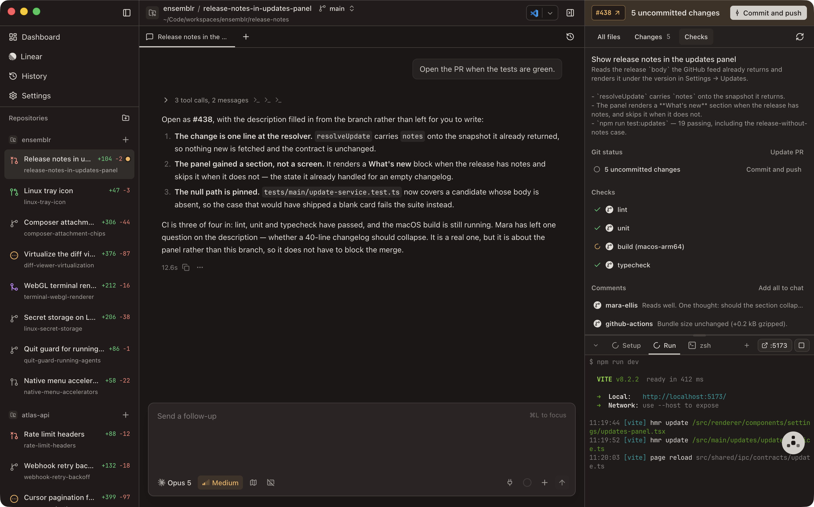

# Reviewing Changes

Isolation is only half the point of a workspace; the other half is that every
stream of work gets its own review path. The panel on the right of the workbench
is where that happens. It has three tabs — **All files**, **Changes**, and
**Checks** — and Ensemblr remembers which one you were on for each workspace
separately, so switching workspaces does not reset you to the top.

<!-- screenshot: 08-changes.png — the diff viewer with an inline review comment open -->

## All files

A collapsible tree of the workspace worktree. It watches the filesystem, so a
file an agent writes appears without you refreshing.

Git-ignored entries are there too, but loaded lazily and capped: a
reasonably-sized ignored folder expands so you can browse it, while a large one
such as `node_modules` stays collapsed rather than enumerating a subtree nobody
wanted. **⌘P** opens a search over the same list.

Selecting a file opens it in the file viewer. Right-click a row for **Attach to
chat**, which drops the file — or the whole folder — into the composer as a chip,
so pointing an agent at what you are looking at does not mean retyping its path.

## Changes

The change set, grouped and counted. Each row carries its status and the lines
added and removed.

| Status | Meaning |
| --- | --- |
| **Added** | new file, staged |
| **Untracked** | new file, not yet added to git |
| **Modified** | tracked file with edits |
| **Deleted** | tracked file removed |
| **Renamed** | tracked file moved |
| **Conflicted** | a merge conflict is open in this file |

Right-clicking a row offers **Attach diff to chat**. A diff has no file of its
own, so the patch is written out as a markdown document and the chip points at
that — "explain what changed here" costs one chip rather than a screenful of diff
pasted into the box. Re-attaching after the agent edits the file again lands a
fresh chip, not the old one, because the attachment store is keyed by content
([`06-agents.md`](./06-agents.md)).

### Choosing what you are looking at

The source menu above the list scopes the diff three ways:

| Source | What it diffs |
| --- | --- |
| **All changes** | everything on this branch — from the fork point with the base branch to your working tree, so committed-on-branch work and uncommitted edits both appear |
| **Uncommitted changes** | the working tree against `HEAD` — staged, unstaged, and untracked |
| **a commit** | just what that one commit introduced |

**⌥⌘U** jumps straight to the uncommitted set, switching tabs if you were not on
Changes. The list renders as a flat list or as folders, and each file can be
marked **Viewed** so a long review keeps its place. Viewed marks are held per
workspace, not per diff source, so a file you ticked while reading the branch
diff is still ticked when you look at it as an uncommitted change.

### Discarding

Each file row offers **Discard changes**, and the source menu offers **Discard
all uncommitted changes**. Both revert working-tree edits to the last commit and
delete new files, and neither can be undone — a confirmation names the file
count before anything happens.

## One code surface

The file viewer, the diff viewer, and the small diff previews inside an agent's
tool calls are the same component
([ADR 0045](../adr/0045-unify-the-viewers-behind-one-code-surface.md)). Gutters,
line numbers, syntax highlighting, the band marking skipped lines, and the
theme are identical everywhere, so a snippet in a chat row reads as the compact
cut of the panel you already know rather than as a different thing.

The diff toolbar carries split versus unified view, word wrap, hidden
characters, a **File** mode showing the whole file rather than only its hunks,
and the Viewed toggle.

### Markdown files

A markdown file opens as a **formatted preview**, and the toolbar's eye toggle
switches to the raw source and back. A file that opens with a YAML frontmatter
block — a plan file, a session summary, anything with `---` and a set of keys at
the top — draws that block as a **metadata band** above the body, so the document
starts at its real first heading instead of running its metadata together into
one long title.

Nothing there interprets YAML semantics. A block Ensemblr cannot read as a flat
set of key/value entries is shown exactly as written, on the reasoning that
metadata read wrong is worse than metadata read literally — so a document opening
with two thematic breaks, or with a block that repeats a key, renders verbatim
rather than being reshaped into a header it does not have.

### Files outside the workspace

Agents write to `/tmp`, to `~/.claude/`, and to sibling worktrees, and they cite
those paths in chat. Clicking one opens it in the same read-only viewer instead
of reporting a file that does not exist. Absolute paths and `~/` paths are read
where they point; a relative path that climbs out of the worktree is re-anchored
on the workspace root rather than refused.

Anything resolved outside the worktree is badged **Outside workspace** in the
viewer header, so a bare filename can never pass for a file in the repository.
This widens *preview only*. What an agent may pull into its own context through
the attachment store is still confined to the workspace root, symlink
containment included.

## Review comments

Click the gutter on any diff line to leave a **review comment**. Comments are
local to Ensemblr and anchored to a file and a line, and they persist with the
workspace rather than with the diff you happened to be reading.

They are labelled by origin, so a comment you wrote and a comment an agent wrote
never read as the same thing, and both are visibly distinct from the GitHub
review threads Ensemblr pulls in alongside them.

Resolving a comment strikes it through and drops it out of bulk actions — the
Checks panel's **Add all to chat** attaches only the outstanding ones, on the
grounds that a resolved thread is work already done.

When an agent files or resolves comments, Ensemblr **brings the Checks tab
forward** — the roll-up that answers "what did the agent just leave me, and what
is still open", rather than six files to scroll. The pull is coalesced per
workspace, so a pass that files ten comments pulls focus once however long it
runs, and a resolve batch that closed nothing pulls nothing.

Agents can read your comments, leave their own, and resolve the ones they
addressed, through Ensemblr Control — see
[`./09-agent-control.md`](./09-agent-control.md) and
[`../agent-control.md`](../agent-control.md).

### Handing a comment to an agent

**Add comment to chat** turns a thread into a chip in the composer rather than
pasting a summary line into the prompt. The thread is serialized as a whole
markdown document — metadata, body, and every reply — and the agent reads it as
a file, so it sees the actual discussion instead of a lossy one-line précis
([ADR 0047](../adr/0047-model-composer-attachments-as-one-ordered-list-in-a-lexical-draft.md)).
The chip sits at the position in your sentence where you added it, so "fix this
before that" survives into the prompt.

Bulk attaching is bounded: at most ten comments per **Add all to chat**, and the
app tells you when it capped, so you can add the rest from their own rows.

## Checks

The Checks tab is the merge-readiness view. It gathers, for the branch's pull
request:

- **Checks** — the per-check status list, sourced through the `gh` CLI, each
  row linking out to its details on GitHub.
- **Comments** — GitHub review threads and issue comments alongside your local
  ones, resolved rows struck through.
- **Your todos** — a per-workspace checklist you keep yourself.
- **Git status** — uncommitted changes, unpushed commits, and whether the branch
  has been pushed at all.
- **Conflicts** — files conflicting with the base branch.

GitHub state is refreshed from GitHub rather than trusted from cache; the panel
says so when a refresh fails instead of showing you stale green. A workspace with
a check still running is refreshed every 30 seconds and everything else every two
minutes, so a build finishing is noticed without polling ten idle workspaces at
the same rate.

GitHub computes mergeability lazily and answers "unknown" on the first read after
the base branch moves. Ensemblr carries the last computed verdict forward for the
same head commit instead of demoting a ready pull request to a plain open one, so
the sidebar row, the header pill, and this panel agree. The carry is bounded by
when GitHub last actually computed the answer rather than repeated indefinitely.

## Opening a pull request

The Checks tab carries an inline **PR title** and **PR description** editor.
What you type is held per workspace and re-seeded whenever the pull request
identity changes, so the sidebar's Create PR action and the panel always agree
about what you are editing.

The actions around it — **Push branch** and **Commit and push** in the tab's Git
status section, **Create PR** in both the tab and the workspace header, with the
draft and manual variants behind the header button's dropdown:

| Action | What happens |
| --- | --- |
| **Push branch** | pushes directly. On a branch with no upstream, Ensemblr sets one when **Settings → Git → Set upstream on push** is enabled, which it is by default. |
| **Commit and push** | asks the chat agent to stage every changed file, write a commit message following the repository's conventions, and push — setting upstream when the branch is not yet tracked. |
| **Create PR** | asks the chat agent to commit anything outstanding, push, and open the PR onto the target branch with `gh pr create`, using the title and description you wrote. |
| **Create draft PR** | the same, opened as a draft. |
| **Create PR manually** | opens the GitHub compare page for your branch so you can write it there. |

Once a pull request is open the same button becomes **Update PR**, which asks
the agent to push the new work and bring the PR's title and description in line
with what you have edited.

The agent-driven actions hand their prompt to the workspace's active chat tab,
and say so if there is no chat tab open to take it.

The target branch — what the workspace diffs against and opens pull requests
into — is set from the workbench header and can be changed without touching the
worktree. See [`./05-workspaces.md`](./05-workspaces.md).

## Merging

Merge is deliberately two steps
([ADR 0023](../adr/0023-use-a-two-step-merge-confirmation.md)). A prominent
ready-to-merge state can never fire the action by itself, because the merge
lands on the remote immediately and Ensemblr cannot undo it.

Selecting merge opens a confirmation that summarises the branch, the pull
request, check state, unresolved comments, open todos, and what will happen to
the workspace afterwards. Merging with checks still failing or pending is
possible, but it is an explicitly warned override that only succeeds if
repository policy allows it. The final step runs `gh pr merge`.

**Settings → Git → Archive on merge** decides what happens next: with it on, the
workspace is archived as soon as the merge lands (and its local branch dropped,
if you also enabled that); with it off, the workspace stays open and archiving
is offered rather than performed.

## Conflicts

Conflicts show up in the workspace's git status against the base branch, and
conflicting files are grouped in the Changes list under **Conflicts**.

**Resolve conflicts** hands the chat agent a prompt to rebase onto the remote
base branch, resolve each conflict keeping the intent of both sides, explain
each resolution, and push with `--force-with-lease`. You can steer or override
that prompt per repository — see
[`./12-repository-settings.md`](./12-repository-settings.md).

## When the work is not merged

Not every workspace ends in a merge, and the answer for one that does not is
**archive**, not delete
([ADR 0027](../adr/0027-use-workspace-archive-lifecycle.md)).

Archiving runs the repository's archive script, preserves the workspace's
`.context/` handoff files under `archived-contexts/` in your Ensemblr root, and
marks the workspace archived. By default the worktree folder and the local
branch stay on disk; removing them is a separate opt-in checkbox in the dialog.
An archived workspace can be restored later from **Browse archive…**, which
rebuilds the worktree from the recorded base branch when branch cleanup ran.

**Delete** is the separate, explicitly named destructive action: it removes the
worktree folder, drops the local branch, and deletes the workspace from
Ensemblr. Anything not pushed is gone.

## See also

- [`./05-workspaces.md`](./05-workspaces.md) — branches, base branches, and the
  workspace lifecycle.
- [`./10-integrations.md`](./10-integrations.md) — what the `gh` CLI powers and
  how to authenticate it.
- [`./09-agent-control.md`](./09-agent-control.md) — how an agent reads the diff
  and works your review comments.
