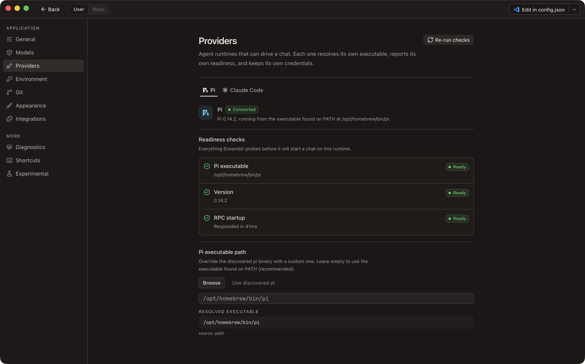
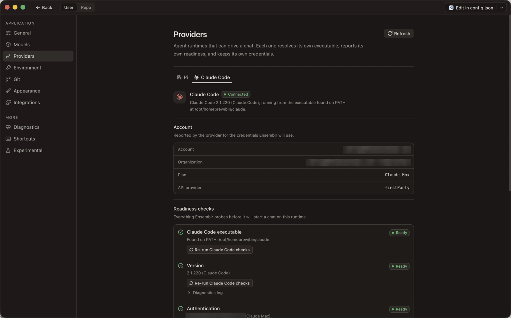

# 11. App settings

Open settings with `⌘,`, or from the app menu. The left rail splits into two
scopes:

- **User** — the panes on this page. They apply to Ensemblr everywhere, across
  every project and workspace.
- **Repo** — per-repository panes, covered in
  [12. Repository settings](./12-repository-settings.md).

Switch between them with the scope toggle at the top of the settings window.

---

## Where app settings live

App settings are stored in `~/.config/ensemblr/config.json`. That file is the
source of truth — not a cache of something else. You can read it, hand-edit it,
and check it into a dotfiles repository.

Values sit under an `app` key, one object per pane:

| Pane | Key in `config.json` |
| --- | --- |
| General | `app.general` |
| Models | `app.models` |
| Git | `app.git` |
| Appearance | `app.appearance` |
| Experimental | `app.experimental` |

The first-run wizard also records its completion timestamp under
`app.onboarding.completedAt`. Clearing that field by hand makes the wizard run
again on the next launch. See [3. First run](./03-first-run.md).

Other top-level keys the file accepts are `environment`, `managed`,
`repositoryDefaults`, `repositoryRules`, `security`, `ui`, and `schemaVersion`.
Any other top-level key is rejected with a diagnostic.

### Live reload

Ensemblr watches `config.json`. Edit it in another editor and the window picks
the change up immediately — there is no restart, and no "reload settings"
command. Ensemblr's own writes are atomic (temp file plus rename), so a save
from the settings UI never leaves a half-written file behind.

### Bad values degrade, they do not break

Every field validates independently and falls back to its own default. A typo in
one value costs you that value, not the file: the rest of your settings still
load. If you want to reset one setting, delete its line and let the default fill
back in.

### Layering

Settings resolve per key. Highest wins:

| Precedence | Source | What it is |
| --- | --- | --- |
| 1 | Managed config | The `managed` block of `config.json`, for policy-set values you cannot override |
| 2 | Personal | Values Ensemblr stores locally for keys that are not in the `app` block |
| 3 | Config defaults | Your own values under the `app` block of `config.json` |
| 4 | Built-in defaults | What ships with Ensemblr |

Repository-scoped settings layer differently and are documented in
[12. Repository settings](./12-repository-settings.md). A setting that resolves
from anywhere other than its default shows a small source badge next to it, so
you can always see which layer supplied the value you are looking at. A value
locked by managed config is marked `locked` and its control is disabled.

Background on the decision: [ADR 0029](../adr/0029-app-settings-source-of-truth-in-config-json.md).

---

## Application

### General

How chats behave day to day, plus where Ensemblr keeps its repositories.

| Setting | What it does | Options | Default |
| --- | --- | --- | --- |
| Language | Interface language. `System` follows your macOS language order. Also governs the native menu bar and the prose agents write back. | System, English, Русский, Ελληνικά | System |
| Send messages with | Which key sends a composer message. The other one inserts a newline. | `↵`, `⌘↵` | `↵` |
| Follow-up behavior | What happens to a message you send while the agent is still working. `Steer` interrupts mid-turn, `Queue` holds it until the turn ends, `Block` holds it until you send it yourself. A queued message stays editable. `⌘J` queues in any mode. | Steer, Queue, Block | Steer |
| Desktop notifications | Notify you when a chat finishes a turn or stops to ask you something. One notification per chat, titled with the chat's own name; clicking it focuses that chat. | On / off | On |
| Notification sound | Play a chime alongside the notification when a chat needs your attention. | On / off | On |
| Caffeinate while agents are running | Keep your Mac awake while an agent is working. Shuts off below 10% battery. | On / off | Off |
| Always show context usage | Show the context meter at all times instead of only past 70% used. | On / off | On |
| Auto-convert long text | Turn pasted text over 5,000 characters into a text attachment instead of inlining it. | On / off | On |
| Don't collapse tool calls | Show tool calls expanded by default. Toggle per session with `⌃O`. | On / off | Off (collapsed) |
| Ensemblr root directory | Where Ensemblr stores repositories, workspaces, and archived workspace context. | Any directory | `~/Ensemblr` |

**The root directory is here, not in an "Advanced" pane** — there is no Advanced
pane. Pick an empty directory you do not edit by hand. Changing it reconciles
your repository list against the new root; the pane reports `ready`, `warning`,
or `error` for the path you choose.

### Models

Model and thinking-level defaults for new chats and for the Review action.
Models come from each configured runtime's own capability discovery, so the list
reflects what your Pi and Claude Code installations actually offer.

| Setting | What it does | Default |
| --- | --- | --- |
| Default model | Model a new chat starts on. Falls back to the runtime-reported default when unset. | Unset |
| Default thinking level | Reasoning level paired with the default model. | Unset |
| Review model | Model used by the Review action on a workspace. | Unset |
| Review thinking level | Reasoning level paired with the review model. | Unset |
| Model visibility | Hide models you don't use from the model picker and from the two selects above. | Nothing hidden |

Thinking levels are `No thinking`, `Minimal`, `Low`, `Medium`, `High`,
`Extra high`, and `Max`. Which of them a given model offers depends on the
runtime — Pi steers *thinking*, Claude Code steers *effort*.

Visibility notes:

- Hiding the model currently selected as default or review switches that
  selection to the first available model.
- At least one model must stay visible; the control locks when you reach one.
- You can hide a whole provider's models in one action.

See [6. Agents](./06-agents.md) for what the runtimes differ on.

### Providers



One tab per agent runtime. Each runtime resolves its own executable, reports its
own readiness, and keeps its own credentials — Ensemblr does not proxy either
one's login.

| | Pi | Claude Code |
| --- | --- | --- |
| Probed command | `pi` | `claude` |
| Login command | — (no login step) | `claude /login` |
| Own settings file | — | `~/.claude/settings.json` |

**Executable path.** Each runtime takes an override. Leave it empty and Ensemblr
uses the executable found on your `PATH`, which is the recommendation. Set it to
pin a specific binary — a version manager's shim, a build outside `PATH`. The
pane shows the resolved executable and whether it came from your override or
from `PATH`. **The Pi executable override lives here**, not in a General or
Advanced pane.

**Readiness checks.** Everything Ensemblr probes before it will start a chat on
that runtime. Each reports `Ready`, `Warning`, or `Failed`, with the reason
inline.

| Check | Runtime | What it verifies |
| --- | --- | --- |
| Executable | Both | A runnable binary was resolved, from `PATH` or from your override |
| Agent directory | Pi | Pi's agent directory resolves, and from where |
| RPC startup | Pi | Starting Pi produces a valid protocol frame |
| Providers and models | Pi | How many models across how many providers are reachable |
| Version | Claude Code | `claude --version` succeeds |
| Authentication | Claude Code | Claude Code is installed *and* signed in |
| MCP servers | Claude Code | How many MCP servers are configured and connected |

Use **Refresh** to re-run every check for that runtime.

**Account.** What the provider reports for the credentials Ensemblr will use:
account, organization, plan, API provider, and credential source. If the
provider reports nothing, the pane says so rather than guessing.



**Plan usage** (Claude Code only). A bar per claude.ai rate-limit window,
showing what the account has spent against its plan. It is read once per
readiness probe, on its own short deadline — a slow usage endpoint costs this
panel alone and leaves the account and MCP rows intact. The same windows,
scoped to one chat's session and paired with that session's running cost, sit in
the composer's context hover card ([6. Agents](./06-agents.md)).

**Sign-in is interactive.** Ensemblr copies the login command to your clipboard
and you run it in a terminal. It never captures the credential.

**Settings file.** Claude Code reads its own configuration from
`~/.claude/settings.json`. The pane links out to it — Ensemblr never edits that
file. Change permissions, hooks, or MCP servers there.

**Sub-agents** (Claude Code only). Which mechanism a first-class Claude Code chat
delegates through. Only one is ever live in a session, so a model is never
holding the playbook for one and the tools for the other.

| Option | What the chat gets | What it loses |
| --- | --- | --- |
| **Ensemblr chat tabs** (default) | Each sub-agent spawns into its own tab you can watch and steer | Claude Code's built-in sub-agent tool is denied |
| **Claude Code built-in** | Sub-agents run inside the conversation, the way the CLI does it | The spawn control tools are withheld |

The mechanism is fixed when a chat opens, so a change applies to chats started
after it, not to ones already running. Pi has no sub-agent tool of its own and
ignores the setting — it always delegates through chat tabs. The reasoning is in
[ADR 0049](../adr/0049-let-the-user-pick-claude-codes-subagent-mechanism.md).

If a check fails, [14. Troubleshooting](./14-troubleshooting.md) has the
remediation steps and [2. Requirements](./02-requirements.md) lists what has to
be installed first.

### Environment

Environment variables Ensemblr uses itself and passes to agent sessions,
scripts, and terminals.

Variables can come from three places:

- **Rows you add** in the pane, each a name and a value.
- **Env files** you point at. Add a file and its variables load from disk. In
  the native file picker, press `⌘⇧.` to reveal hidden files — `.env` is hidden.
- **An Infisical project**, when the repository's Secrets pane links one. Those
  values are fetched live at every launch and never edited here.

They layer in a fixed order, later winning:

```
env files  <  infisical  <  rows you add  <  Ensemblr secrets
```

A value you set by hand therefore beats one Infisical resolved, which is what
debugging against a local service expects.

**Secret values are masked.** A variable is treated as secret when the built-in
catalogue says so, or — for a variable you invent — when its name looks
sensitive (contains `TOKEN`, `KEY`, `SECRET`, and similar). Masked values render
as dots with a show/hide toggle per row. Secret values are stored in the macOS
Keychain, not in a file.

Variable names may contain only letters, numbers, and underscores. An empty
value is legal and sets the variable to the empty string, which is different
from leaving it unset.

#### The built-in catalogue

Ensemblr ships a catalogue of 20 variables it already understands. They appear
under **Show documented variables**, marked `Not set` until you give one a
value. Adding a value to a catalogue entry does not change the variable's
meaning, only its value.

Each entry carries three statuses:

| Status | Meaning |
| --- | --- |
| `required` | Ensemblr will not work without it. **No built-in entry is currently required** — every one is optional. |
| `masked` | Value kind is `secret`: hidden by default, stored in the Keychain. |
| `reserved` | Ensemblr populates it per workspace at run time. Do not set it yourself. |

| Variable | Category | Scope | Masked | Reserved | Purpose |
| --- | --- | --- | --- | --- | --- |
| `PI_CODING_AGENT_DIR` | Pi | App | No | No | Optional Pi agent directory override. Leave unset to keep your normal Pi user environment. |
| `HTTP_PROXY` | Proxy | App | Yes | No | HTTP proxy for tools honouring standard proxy variables. |
| `HTTPS_PROXY` | Proxy | App | Yes | No | HTTPS proxy for tools honouring standard proxy variables. |
| `ALL_PROXY` | Proxy | App | Yes | No | Fallback proxy for tools supporting `ALL_PROXY`. |
| `NO_PROXY` | Proxy | App | No | No | Comma-separated hosts that bypass the configured proxies. |
| `OPENAI_API_KEY` | Provider | App | Yes | No | Ensemblr-owned provider credential. |
| `ANTHROPIC_API_KEY` | Provider | App | Yes | No | Ensemblr-owned provider credential. |
| `GOOGLE_API_KEY` | Provider | App | Yes | No | Ensemblr-owned provider credential. |
| `GEMINI_API_KEY` | Provider | App | Yes | No | Ensemblr-owned provider credential. |
| `GROQ_API_KEY` | Provider | App | Yes | No | Ensemblr-owned provider credential. |
| `MISTRAL_API_KEY` | Provider | App | Yes | No | Ensemblr-owned provider credential. |
| `OPENROUTER_API_KEY` | Provider | App | Yes | No | Ensemblr-owned provider credential. |
| `VERCEL_AI_GATEWAY_API_KEY` | Provider | App | Yes | No | Ensemblr-owned provider credential. |
| `DEBUG` | Generic | App | No | No | Debug selector for tools and scripts honouring `DEBUG`. |
| `CI` | Generic | App | No | No | CI flag for tools that change behaviour in continuous integration. |
| `ENSEMBLR_WORKSPACE_NAME` | Runtime | Workspace | No | **Yes** | Name of the workspace the process is running in. |
| `ENSEMBLR_WORKSPACE_PATH` | Runtime | Workspace | No | **Yes** | Absolute path to the workspace worktree. |
| `ENSEMBLR_ROOT_PATH` | Runtime | Workspace | No | **Yes** | Absolute path to the Ensemblr root directory. |
| `ENSEMBLR_DEFAULT_BRANCH` | Runtime | Workspace | No | **Yes** | The repository's default branch. |
| `ENSEMBLR_PORT` | Runtime | Workspace | No | **Yes** | The port allocated to this workspace. |

The five reserved `ENSEMBLR_*` variables are the ones your run scripts, preview
URLs, and terminals can rely on. See
[7. Terminals and run scripts](./07-terminals-and-run-scripts.md).

Provider credentials are a choice, not a requirement: Pi-owned provider
credentials should stay in your Pi user environment unless you deliberately want
Ensemblr to own them.

A variable you add that is not in the catalogue is classified as `custom`, and
masked automatically if its name looks sensitive.

### Git

Defaults for workspace branches and lifecycle. Every one of these is a *user*
default — a repository can override it, and a committed repository value wins.
See [12. Repository settings](./12-repository-settings.md).

| Setting | What it does | Options | Default |
| --- | --- | --- | --- |
| Branch name prefix | Where the prefix for new workspace branch names comes from. `GitHub username` resolves it through the `gh` CLI. `Custom` uses the text you type. `None` uses no prefix. | GitHub username, Custom, None | GitHub username |
| Custom branch prefix | The literal prefix, used only when the source above is `Custom`. | Any string | Empty |
| Let agents name the workspace and branch | Ask the agent to rename a workspace away from its placeholder composer name, and its git branch to match, once it knows what the work is. Off leaves the placeholder in place. | On / off | On |
| Delete branch on archive | Delete the local branch when a workspace is archived. The remote branch is untouched — configure that on GitHub. | On / off | Off |
| Archive on merge | Archive a workspace automatically after its pull request merges. | On / off | Off |
| Set upstream on plain `git push` | Configure new workspaces so a bare `git push` sets the branch upstream. Turning it off avoids writing git worktree config, at the cost of less reliable PR information until branches have an upstream. | On / off | On |

Workspace and branch mechanics are covered in
[5. Workspaces](./05-workspaces.md); the merge and archive path in
[8. Reviewing changes](./08-reviewing-changes.md).

### Appearance

Theme, syntax highlighting, the fonts used for code, diffs, and the integrated
terminal, and how much scrollback each terminal pane holds.

| Setting | What it does | Options | Default |
| --- | --- | --- | --- |
| Theme | App theme. `System` follows macOS. Also switchable from the app menu. | System, Light, Dark | System |
| Accessible colors | Palette tuned for a colour vision difference. | Default, Protanopia, Deuteranopia, Tritanopia | Default |
| Code theme | Syntax highlighting for code blocks and editors. Each entry is a theme *family*: Ensemblr uses its light cut in light mode and its dark cut in dark mode. | `catppuccin-mocha`, `catppuccin-latte`, `github-dark`, `github-light`, `one-dark-pro`, `solarized-dark` | `catppuccin-mocha` |
| Code ligatures | Use font ligatures in file editors and diffs. | On / off | On |
| Markdown style | Rendering style for markdown files. | Default, Compact, Prose | Default |
| Mono font | Font for code and diffs. A custom font must already be installed on your system, and the name must match exactly. | Any installed font name | `JetBrainsMono Nerd Font Mono` |
| Terminal font | Font for the integrated terminal, same rules. | Any installed font name | `JetBrainsMono Nerd Font Mono` |
| Terminal font size | Text size in the integrated terminal. | 8–24 | 12 |
| Terminal scrollback limit | Maximum size of each terminal pane's scrollback buffer, in megabytes. Larger values keep more history and cost more memory. | 1–200 MB | 10 MB |

**Terminal scrollback is here**, in Appearance — not in a separate terminal or
advanced pane.

### Integrations

Third-party services Ensemblr signs in to on your behalf. Each is optional and
can be disconnected at any time.

| Integration | States | Notes |
| --- | --- | --- |
| Linear | Connected, Disconnected, Reconnect required, Not configured | Connect to browse Linear issues, manage them from Ensemblr, and create workspaces from issues. |
| Infisical | one row per configured account | Machine-Identity accounts that repository secret links resolve through. |

Linear needs a client id before it can be connected at all: add
`app.linear.clientId` to `~/.config/ensemblr/config.json`. Without it the pane
reads `Not configured`. Linear is optional — local and GitHub-only workflows
never need it.

`Reconnect required` means the stored token expired and could not be refreshed
automatically. Reconnecting is a full sign-in, in your browser.

**Linear is a list, not a switch.** Connect as many organizations as you need;
each is its own row with its own state, and a row that needs reconnecting says
so without disturbing the others. Disconnecting one takes its cached issues and
its Keychain entries with it and leaves the rest alone.

**Infisical** lists the Machine Identity accounts on this machine, with add,
re-check, and remove. An account is the credential half of a secrets link; the
project half lives in the repository's own **Secrets** pane, and is committed.
Removing an account arms on the first click rather than deleting on it —
Infisical shows a Universal Auth client secret exactly once, so there is no
undo. Details in [10. Integrations](./10-integrations.md).

GitHub is not on this pane. Ensemblr shells out to the `gh` CLI and stores no
GitHub token of its own. See [10. Integrations](./10-integrations.md).

---

## More

### Diagnostics

A rollup of the setup gate checks for Pi, git, GitHub, Linear, and the Ensemblr
runtime — the same checks the first-run wizard walks you through. Each check
that is not passing carries its own remediation action inline, so you can fix it
from this pane rather than looking up the command.

| Control | What it does |
| --- | --- |
| Copy diagnostics bundle | Copies a support bundle to the clipboard. It redacts secrets, account ids, and full paths before it leaves the app. |
| Setup wizard → Re-run wizard | Reopens the first-run wizard. Nothing already configured is undone — it re-probes every check and walks you through whatever is still unresolved. |

For what each check requires, see [2. Requirements](./02-requirements.md). For
what to do when one keeps failing, see
[14. Troubleshooting](./14-troubleshooting.md).

### Shortcuts

A read-only reference of every keyboard shortcut Ensemblr binds, grouped by the
scope it is active in, rendered in your app language. Shortcuts are not
rebindable yet.

The same table, in English, is
[13. Keyboard shortcuts](./13-keyboard-shortcuts.md).

### Experimental

Developer-only controls and early automation defaults.

| Setting | What it does | Default |
| --- | --- | --- |
| Auto-run after setup | Start a repository's run script automatically after setup, when no repository-specific setting overrides it. | Off |
| Developer Mode | Show developer-only diagnostics and Pi debug controls. | Off |

---

## Repository panes

Switching the scope toggle to **Repo** gives you seven panes for the repository
selected in the picker. They do not all write to the same place, and that
matters — one set is committed and reviewed like code, the other is personal to
your machine.

| Pane | Writes to | Shared with your team? |
| --- | --- | --- |
| Environment | Local state, with secret values in the macOS Keychain | No |
| **Secrets** | **`.ensemblr/settings.toml`** `[infisical]` — the committed file | **Yes** |
| Git | Local state | No |
| **Scripts** | **`.ensemblr/settings.toml`** — the committed file | **Yes** |
| Actions | Local state, layered under the committed `[prompts]` block | Partly |
| Security | Local state, for the agent permission mode | No |
| Misc | Local state | No |

**Secrets** links this repository to an Infisical project. It asks which
project, never which account: projects are listed across every configured
account at once and each row carries the account that reached it, so picking the
project settles the account. Save stays hidden until something actually changed.
What is committed is the project, environment, and path — never a credential.

Only the Scripts pane writes the committed file. Saving there rewrites
`.ensemblr/settings.toml` — every other section of the file survives by value,
the write is atomic, and a file that does not parse is never overwritten. It
does lose hand-written comments and blank-line grouping, which is the accepted
cost of not shipping a comment-preserving TOML editor.

The other panes write personal rows that never touch the repository. Where a
committed key and a personal row define the same setting, **the committed value
wins** and your personal edit is stored but shadowed. Several panes say so
inline.

Full reference for the committed file, including every key it accepts:
[12. Repository settings](./12-repository-settings.md). Background:
[ADR 0030](../adr/0030-use-ensemblr-settings-toml-as-sole-repository-config.md)
and
[ADR 0041](../adr/0041-write-repository-scripts-to-ensemblr-settings-toml.md).

---

← [10. Integrations](./10-integrations.md) ·
[Guide index](./README.md) ·
[12. Repository settings](./12-repository-settings.md) →
