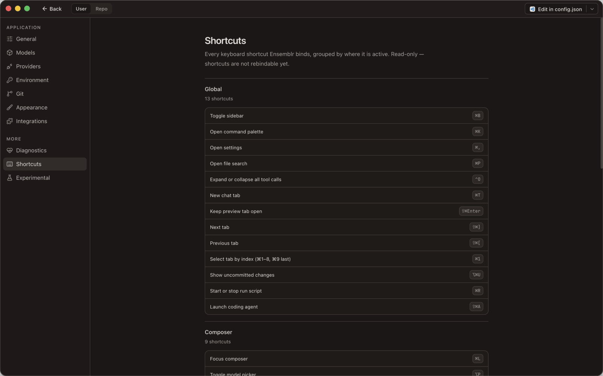

# 13. Keyboard shortcuts

Ensemblr binds 35 shortcuts. This page lists all of them.

## How to read these tables

**Symbols.**

| Symbol | Key |
| --- | --- |
| `⌘` | Command |
| `⌥` | Option |
| `⇧` | Shift |
| `⌃` | Control — the physical Control key, distinct from `⌘` |
| `↵` | Return |
| `⇥` | Tab |
| `⎋` | Escape |
| `↑` `↓` | Arrow keys |

**Modifiers are exact.** Every modifier shown must be held, and every modifier
*not* shown must not be. `↵` means Return with nothing held — it will not fire
if Shift is down. That is why `↵`, `⇧↵`, and `⌘↵` are three separate shortcuts
in the composer rather than one loose binding.

**Shortcuts are scoped.** Each one is active only in a particular layer of the
UI, so the same chord can mean different things depending on where you are. `⌘↵`
sends a message in the composer, submits a diff comment on a review thread, and
submits a dialog form — three different shortcuts, one chord, routed by what has
focus. A shortcut listed under `composer` does nothing while a dialog is open.

---

## Global

Active anywhere in the workbench.

| Shortcut | Does | Id |
| --- | --- | --- |
| `⌘B` | Toggle sidebar | `sidebar.toggle` |
| `⌘K` | Open command palette | `palette.open` |
| `⌘,` | Open settings | `settings.open` |
| `⌘P` | Open file search | `files.search` |
| `⌘T` | New chat tab | `tab.new` |
| `⌘R` | Start or stop run script | `run.start` |
| `⌃O` | Expand or collapse all tool calls | `toolCalls.toggleCollapse` |
| `⌘⇧A` | Launch coding agent | `agents.open` |
| `⌘⌥U` | Show uncommitted changes | `changes.uncommitted` |
| `⌘⇧↵` | Keep preview tab open | `tab.keepOpen` |
| `⌘⇧]` | Next tab | `tab.next` |
| `⌘⇧[` | Previous tab | `tab.prev` |
| `⌘1` … `⌘9` | Select tab by index — `⌘1`–`⌘8` pick that tab, `⌘9` picks the last | `tab.selectByIndex` |

`⌘R` toggles: it starts the default run script, and stops it if it is already
running. Which script is the default is set per repository — see
[12. Repository settings](./12-repository-settings.md).

`⌃O` uses the physical Control key, not Command. It flips every tool call in the
current conversation between expanded and collapsed; the starting state is the
**Don't collapse tool calls** setting in
[11. App settings](./11-app-settings.md).

## Menu

Fired from the native macOS menu bar, and bound to the same chord.

| Shortcut | Does | Id |
| --- | --- | --- |
| `⌘N` | New workspace | `workspace.new` |
| `⌘W` | Close tab | `tab.close` |
| `⌘/` | Open keyboard shortcuts | `help.shortcuts` |
| `⌘⌥B` | Toggle right sidebar | `layout.toggleRightSidebar` |
| `⌘⌥J` | Toggle dock | `layout.toggleDock` |
| ``⌃⇧` `` | New terminal (Control-Shift-backtick) | `terminal.new` |

## Composer

Active when the message composer has focus.

| Shortcut | Does | Id |
| --- | --- | --- |
| `⌘L` | Focus composer | `composer.focus` |
| `↵` | Send message | `composer.submit` |
| `⌘↵` | Send message | `composer.submitWithMod` |
| `⇧↵` | Insert newline in composer | `composer.newline` |
| `⌘J` | Queue message as a follow-up | `composer.queue` |
| `⌥P` | Toggle model picker | `composer.toggleModelPicker` |
| `⌥T` | Cycle thinking level | `composer.cycleThinking` |
| `⌥⇧P` | Toggle plan mode | `composer.togglePlanMode` |
| `⌘↵` | Submit diff comment | `diffComment.submit` |

Two of these need a word.

**`↵` and `⌘↵` both send.** Which one is *your* send key is the **Send messages
with** setting; the other inserts a newline. Both ids exist because the menu
item has to describe one of them, and because the app reports both as live.

**`⌘J` queues in any mode**, regardless of what **Follow-up behavior** is set to
— it is the escape hatch when you want this one message held rather than
steering the running turn.

**`diffComment.submit` is composer-scoped, not dialog-scoped.** A review-comment
box is a composer, so `⌘↵` submits the comment when one has focus. See
[8. Reviewing changes](./08-reviewing-changes.md).

## Dialogs

Active when a modal dialog or an agent question is open.

| Shortcut | Does | Id |
| --- | --- | --- |
| `⌘↵` | Submit dialog form | `dialog.submit` |
| `⌘↵` | Submit answers to an agent question | `question.submit` |

Two ids share a chord because they are two different surfaces: a generic form,
and the questionnaire an agent raises through Ensemblr Control. Only one of them
can be open at a time.

## Autocomplete

Active only while the autocomplete popover is showing in the composer — for file
mentions, issue references, and slash commands.

| Shortcut | Does | Id |
| --- | --- | --- |
| `↓` | Next autocomplete entry | `autocomplete.next` |
| `↑` | Previous autocomplete entry | `autocomplete.prev` |
| `↵` or `⇥` | Confirm autocomplete selection | `autocomplete.confirm` |
| `⎋` | Close autocomplete popover | `autocomplete.dismiss` |

`autocomplete.confirm` is the one shortcut bound to two keys. While the popover
is open, `↵` confirms the highlighted entry instead of sending the message —
dismiss with `⎋` first if you meant to send.

## Model picker

Active only while the model picker is open.

| Shortcut | Does | Id |
| --- | --- | --- |
| `1` … `9` | Select model by index | `modelPicker.selectByIndex` |

Bare digits, no modifier — the picker owns the keyboard while it is open. This
is distinct from `⌘1`–`⌘9`, which select a tab globally.

---

## Why some chords have no menu item

On macOS, AppKit matches a menu item's key equivalent **before** the keydown
ever reaches the app's UI. A menu item that *displays* a shortcut therefore also
*claims* it, app-wide.

That makes an accelerator impossible for any chord the app has to disambiguate
by context. `⌘↵` is the clearest case: it means "send message", "submit diff
comment", "submit dialog form", and "submit answers to an agent question"
depending on what has focus. If a menu item claimed `⌘↵`, it would fire the
composer handler while you were typing a review comment. So the composer and
dialog chords carry no menu accelerator, and the layer that knows which handler
applies gets the keydown.

The rule Ensemblr follows:

| Shortcut kind | Menu accelerator? |
| --- | --- |
| Unambiguous, one meaning app-wide (`⌘B`, `⌘K`, `⌘R`, `⌘N`) | Yes |
| Meaning depends on which surface has focus (`⌘↵`, `↵`, `⌥P`) | No |
| Dynamic — the item list is built at run time (`⌘1`–`⌘9`, run scripts) | No |

The menu items for the composer actions still exist and still work; they just
show no shortcut next to them. Background:
[ADR 0046](../adr/0046-drive-the-native-menu-bar-from-a-renderer-command-bus.md).

A related consequence: a menu item whose surface has registered no handler
renders **disabled** rather than silently doing nothing. If a menu item is
greyed out, the command does not apply where you are right now.

---

## The same table, in the app

**Settings → More → Shortcuts** renders this list inside Ensemblr, translated
into your app language, grouped by the same scopes. Open it with `⌘/`.

It is read-only. Shortcuts are not rebindable yet.

---

*This table is transcribed from the app's keymap. Regenerate it when the keymap
changes.*

---

← [12. Repository settings](./12-repository-settings.md) ·
[Guide index](./README.md) ·
[14. Troubleshooting](./14-troubleshooting.md) →
