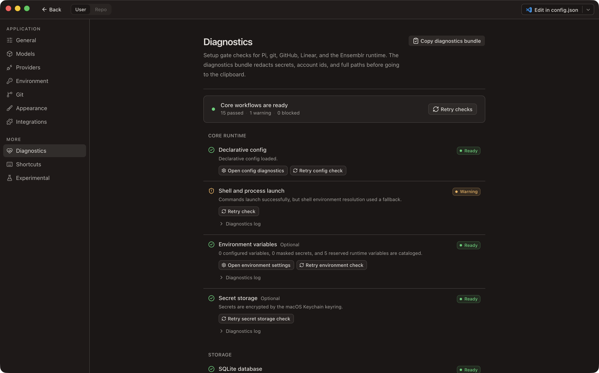

# Troubleshooting

Organized by what you see. Each entry names the symptom, the cause, and the fix.

**Settings → Diagnostics is the first place to look.** It runs all fifteen setup
checks, shows the command output each one collected, and offers the fix for
every failure. **Copy diagnostics bundle** puts the whole rollup on the
clipboard with secrets, account ids, and full paths redacted — safe to paste
into a bug report.



## Getting in

### The wizard will not let me past a step

**Cause.** The step's gate is not met, and it is a required step.

**Fix.** Either satisfy the check or defer it. **I'll do this later** unlocks
**Continue**; anything deferred is listed on the Ready screen and lives on in
Diagnostics. A deferred step is not a satisfied one — with GitHub deferred, every
pull-request, review, and merge action fails until you come back to it.

If the step is **Agent CLI**, check what is actually being asked: it needs Pi
**or** Claude Code, not both. See
[the either-or gate](./02-requirements.md#the-either-or-gate).

To leave the wizard entirely, use **Skip setup** on the welcome screen. Reopen it
later from **Settings → Diagnostics → Setup wizard → Re-run wizard**.

### "Ensemblr is damaged and can't be opened"

**Cause.** The build is unsigned, so it carries no notarization ticket and
Gatekeeper refuses it. Nothing is damaged. A build is signed and notarized only
when `APPLE_API_KEY_PATH`, `APPLE_API_KEY_ID`, and `APPLE_API_ISSUER` are all
present at build time; miss one and the same `npm run make` produces an unsigned
app rather than failing.

**Fix.** Right-click (or Control-click) `Ensemblr.app` in Finder, choose
**Open**, then confirm **Open** in the dialog. macOS remembers the exception, so
later launches work normally. Double-clicking the first time does not offer that
choice — the right-click path is the one that works.

## Building

### `npm run make` exits 0 and `out/` is empty

**Cause.** You are on the wrong Node major. Under Node 26, `electron-forge
package` exits successfully and produces no artifacts.

**Fix.** Switch to Node 24 and rebuild:

```bash
node -v          # must report v24.x
nvm use          # reads .nvmrc — or `mise install`, if you use mise
npm run make
```

Ensemblr pins Node 24 in `.nvmrc`, `mise.toml`, and `package.json` (`engines:
">=24 <25"`), and gates both `npm install` and the build commands on it. If the
gate did not fire, something is invoking Forge directly rather than through the
npm script.

### `NODE_MODULE_VERSION` mismatch during `make`

**Cause.** You ran `npm install` under a different Node major than the one you
are building with. `macos-alias` and `fs-xattr` compiled against that major, and
the mismatch only surfaces later, at packaging time — long after the mistake.

**Fix.** Reinstall under Node 24:

```bash
nvm use
rm -rf node_modules
npm install
npm run make
```

Non-interactive shells — a workspace `setup` script, CI, a git hook — never
source the mise or nvm hooks, so they run under whatever Node is on `PATH`.
Prefix those with `./scripts/with-pinned-node.sh`, which resolves the pinned Node
and then execs your command unchanged.

## Terminals and agents

### A terminal fails to spawn

**Cause.** `node-pty` ships its prebuilt `spawn-helper` binaries without the exec
bit. A non-executable helper surfaces as an opaque PTY spawn failure rather than
a permissions error.

**Fix.** Re-run `npm install`, which marks them executable as a `postinstall`
step. To confirm it took, `ls -l node_modules/node-pty/prebuilds/*/spawn-helper`
— each should be mode `755`.

### An Infisical secret is missing from a terminal or agent

**Cause.** One of four, in the order worth checking. The repository has no link
(**Settings → Repo → Secrets** shows no project). The link resolves to no local
account — the project half is committed and the Machine Identity is not, so a
freshly cloned repository needs an account added under **Settings →
Integrations**. The secret lives under a path the link does not cover, and
`recursive` is off. Or a value you set by hand is winning: the layer order is
`env files < infisical < local rows < Ensemblr secrets`, and everything to the
right of Infisical overrides it.

**Fix.** Check the link and the account first, then widen `path` or turn on
`recursive`. Values resolve at **launch**, so a terminal or agent started before
the change keeps the old environment — restart it. If Infisical was unreachable,
the workspace still opens: the layer falls back to the last resolved values and
warns rather than failing, so an unexplained *stale* value is the signature of a
failed fetch rather than a bad link.

### `gh-auth` is red although I am logged in

**Cause.** The check runs exactly this:

```bash
gh auth status --hostname github.com --active
```

Two things fail it that do not look like being logged out. `--active` means the
account must be the *currently active* one, so having several configured and
switched to a different one fails the check. `--hostname github.com` means only
github.com counts, so an account on a GitHub Enterprise host does not satisfy
it.

**Fix.** Run the same command yourself to see what `gh` reports, then either
switch the active account back or log in for github.com:

```bash
gh auth switch --hostname github.com --user <your-username>
gh auth login --hostname github.com
```

Then **Retry** the check.

### `claude` is not found although it is installed

**Cause.** Ensemblr resolves `claude` from the `PATH` it derives from your login
shell. A GUI app inherits a different environment than your terminal, and an
install that only appears after a shell function, a version manager shim, or a
line in a file your login shell does not read will be invisible to it.

**Fix, in order of preference:**

1. Confirm what Ensemblr sees. **Settings → Diagnostics → Shell and process
   launch** reports `warning` when Ensemblr fell back to a synthesised
   environment instead of reading your shell's — a strong hint your `PATH` never
   reached it.
2. Point Ensemblr at the binary. **Settings → Providers → Claude Code executable
   path** takes an absolute path (`which claude`) and overrides discovery. Leave
   it empty to use `PATH`, which is the recommended state when `PATH` works.
3. Set it per repository. `.ensemblr/settings.toml` accepts
   `claude_executable_path`, for when one project needs a different binary.

An override that stops working is reported distinctly: *"The configured Claude
Code executable could not be run. Clear the override to fall back to the claude
on your PATH, or pick a runnable binary."* Clear the field to fall back.

### Claude Code says I am not signed in

**Cause.** Ensemblr stores no Claude credential and ships no Claude binary. It
drives *your* `claude` install through the SDK, and that install carries its own
session.

**Fix.** In a terminal:

```bash
claude /login
```

Then re-run the checks under **Settings → Providers**.

If the provider check instead reports that Claude started but did not answer
within the deadline, run `claude` in a terminal — it is usually sitting on a
pending login or a Keychain prompt that nothing in Ensemblr can click.

### `pi-rpc` or `pi-provider-model` is failing

These two are separate failures with separate fixes.

**`pi-rpc`** launches the selected Pi executable with `--mode rpc` from a managed
throwaway workspace and expects a valid JSONL frame back. It fails when the
binary is not Pi, is a wrapper that prints something else first, or dies at
startup. Diagnostics shows the exact command, the working directory, and both
output streams — read the `stderr` log first. Fix it by selecting a different
executable (**Select Pi executable**, or **Settings → Providers**).

**`pi-provider-model`** runs `pi --list-models` and expects providers and models
back. It fails when Pi runs but has no usable provider configured — most often a
missing or rejected API key. Fix that in Pi's own configuration, not in
Ensemblr; **Open Pi provider settings** takes you to the relevant screen.

Both are gated: if Claude Code is working, neither blocks the app. They stay red
because they are genuinely broken, and Pi chats will not open.

### Codex or Vibe is missing from the harness menu

**Cause.** A harness appears in the menu only when its binary is found on
`PATH`. There is no setup check for them and no error — an absent harness is
silently absent.

**Fix.** Install the CLI from its vendor and confirm it resolves — `which codex`,
`which vibe`. If it resolves in your terminal but the menu is still empty, it is
the same `PATH` problem as the `claude` entry above. Unlike the agent runtimes,
harnesses have **no** path override — the binary has to be on the `PATH`
Ensemblr sees, so restart the app after changing your shell profile.

Harness credentials are each tool's own; Ensemblr manages none of them. See
[`../harnesses.md`](../harnesses.md).

## Root directory and state

### The root directory warns about shared or non-empty content

Two distinct messages:

**"Root contains unmanaged top-level content"** — an error. Anything in the root
other than `repos/`, `workspaces/`, `archived-contexts/`, and `.DS_Store` trips
it, and Ensemblr declines to create its subdirectories there. This is what
happens when you point the root at an existing folder such as `~/Projects`.
**Fix:** pick a dedicated directory. **Settings → General → Ensemblr root
directory**, or **Choose another root** on the check itself.

**"Managed directory *x* already contains content; it may be a shared or
previously used root"** — a warning, not an error; Ensemblr carries on. It is
expected when you re-point at a root you used before, and worth acting on when
two installs are quietly sharing one. **Fix:** if it is a root you used before,
ignore it. If two builds are sharing one, give each its own — release, canary,
and dev builds keep separate databases but will share a root if you point them
at one.

The path must be absolute or start with `~/`. A relative path is rejected.

### Where state lives, and how to reset

| What | Where |
| --- | --- |
| App settings | `~/.config/ensemblr/config.json` |
| Projects, workspaces, sessions, board state | `~/Library/Application Support/dev.ensemblr.app/ensemblr.db` |
| Secrets (Linear OAuth token) | macOS Keychain, service `dev.ensemblr.app.secret-store` |
| Your repositories and worktrees | The root directory — `~/Ensemblr` by default |

**There is no app log file.** The diagnostics bundle from **Settings →
Diagnostics** is the support artifact; it carries each check's collected command
output, redacted. For a crash on launch, run the app from a terminal to see its
stderr.

To reset Ensemblr's own state while keeping your work, quit the app and delete
the first two. Ensemblr recreates both on next launch, re-runs its migrations,
and shows the first-run wizard again. Your repositories and worktrees are
untouched, but Ensemblr's record of them is gone — you re-add the projects.

Deleting the root directory deletes your worktrees and any unpushed work in
them. Confirm everything is pushed first.

The canary and dev channels use their own bundle-id-scoped paths, so resetting a
release build leaves them alone.

## Still stuck

- [Requirements](./02-requirements.md) — every check and its fix.
- [First run](./03-first-run.md) — the wizard, the gates, the root directory.
- [`../build-and-release.md`](../build-and-release.md) — packaging and signing.
- [`../harnesses.md`](../harnesses.md) — harnesses and their launch flags.
- [`../agent-control.md`](../agent-control.md) — what an agent may drive.
