# Dependency Map

Date: 2026-06-04

This map is generated from the local planning IDs in `docs/product/linear-issues.md`. Replace `PID-*` IDs with Linear issue keys after import.

## Critical Path

- Foundation services (`PID-001` through `PID-008`) unblock setup, repositories, storage, config, secrets, root, command execution, and establish the structural workbench shell contract.
- Foundation UI creates fixture-backed sidebar, workspace header, chat tab, review panel, PR-state header, and dock regions. Later workspace, Pi, terminal, Linear, GitHub, and review tickets wire live TanStack Query/IPC data into those regions instead of rebuilding them.
- Setup/config (`PID-009` through `PID-016`) unblocks ready-state gating, Pi executable/RPC checks, `gh`, env/secrets, repository config, and safe root changes.
- Workspace core (`PID-017` through `PID-025`) replaces fixture shell data with live repository/workspace records and unblocks Pi sessions, terminal/scripts, Linear workspace creation, and GitHub review flows while preserving current navigation, pinning, context-menu, header, and open-target affordances.
- Pi runtime (`PID-026` through `PID-035`) unblocks agent timeline, checkpoints, context-to-Pi, and agent-assisted review/PR work.
- Terminal/scripts (`PID-036` through `PID-042`) replaces the existing dock log placeholders in place with setup/run/archive execution, env injection, and process UI.
- Linear (`PID-043` through `PID-049`) depends on Keychain/SQLite/setup surfaces and workspace core for workspace-from-issue.
- GitHub/review (`PID-050` through `PID-060`) wires the existing All files/Changes/Checks regions and right PR header, and depends on workspace core, `gh`, git status, Pi composer, and checks metadata.
- Settings/polish (`PID-061` through `PID-069`) depends on underlying services so settings show real state and source diagnostics.
- Deferred issues (`PID-070` through `PID-074`) should not block core milestones.

## Mermaid Graph

```mermaid
flowchart TD
  subgraph S1__Foundation["1. Foundation"]
    P001["PID-001 Electron App Shell Scaffold"]
    P002["PID-002 Piductor Design System Foundation"]
    P003["PID-003 SQLite Database and Migrations"]
    P004["PID-004 Keychain Secret Store"]
    P005["PID-005 Declarative Config Loader and JSON Schema Stub"]
    P006["PID-006 Configuration Resolution Engine"]
    P007["PID-007 Root Directory Service"]
    P008["PID-008 Local Command Environment Service"]
  end
  subgraph S2__Setup_Gate_and_Configuration["2. Setup Gate and Configuration"]
    P009["PID-009 Setup Gate Diagnostics UI and Model"]
    P010["PID-010 Git and gh Readiness Checks"]
    P011["PID-011 Pi Executable Discovery and Override"]
    P012["PID-012 Pi RPC and Provider Readiness Smoke Checks"]
    P013["PID-013 Workspace Trust and Permission-Mode Baseline"]
    P014["PID-014 Environment Variable Catalog and Secret Metadata"]
    P015["PID-015 Repository Config Parser for piductor.json, conductor.json, and .worktreeinclude"]
    P016["PID-016 Root Switch Reindex/Adopt Flow"]
  end
  subgraph S3__Repository_and_Workspace_Core["3. Repository and Workspace Core"]
    P017["PID-017 Project Add Menu and Recents"]
    P018["PID-018 Local Repository Registration"]
    P019["PID-019 GitHub Clone Flow with Progress and Errors"]
    P020["PID-020 Sidebar Repository/Workspace Navigation"]
    P021["PID-021 Git Worktree Workspace Creation"]
    P022["PID-022 Files-to-Copy Implementation"]
    P023["PID-023 Workspace Landing Summary and First Composer Surface"]
    P024["PID-024 Shared-Root Workspace Adoption and Reconciliation"]
    P025["PID-025 Workspace Archive and Context Lifecycle"]
  end
  subgraph S4__Pi_CLI_RPC_Runtime_and_Agent_Timeline["4. Pi CLI RPC Runtime and Agent Timeline"]
    P026["PID-026 PiAgentClient RPC Boundary"]
    P027["PID-027 RPC Process Supervisor and JSONL Stream Handling"]
    P028["PID-028 Pi Session Metadata Mapping"]
    P029["PID-029 Pi Composer Submit, Stop, and Model Controls"]
    P030["PID-030 Structured Pi Timeline Rendering"]
    P031["PID-031 Runtime Error Retry and Session-Fork Discovery"]
    P032["PID-032 Git-Backed Checkpoint Capture"]
    P033["PID-033 Checkpoint Restore and Turn Diff"]
    P034["PID-034 Chat Tab Limit and Session Tab Model"]
    P035["PID-035 Pi Capability Discovery for Modes, Context, Browser, and Permissions"]
  end
  subgraph S5__Terminal__Scripts__and_Processes["5. Terminal, Scripts, and Processes"]
    P036["PID-036 Main-Process PTY Service"]
    P037["PID-037 xterm.js Terminal Adapter and Dock UI"]
    P038["PID-038 Setup, Run, and Archive Script Lifecycle"]
    P039["PID-039 Workspace Environment Variables and Port Allocation"]
    P040["PID-040 Run Script Concurrency and Process Controls"]
    P041["PID-041 Preview URL Detection Discovery"]
    P042["PID-042 Spotlight Testing Discovery"]
  end
  subgraph S6__Linear_Integration["6. Linear Integration"]
    P043["PID-043 Linear OAuth PKCE and Token Lifecycle"]
    P044["PID-044 Linear API Schema and Capability Discovery"]
    P045["PID-045 Linear Cache and Sync Service"]
    P046["PID-046 Linear Issue Browse, Search, and Read UI"]
    P047["PID-047 Linear Issue Create, Update, and Comment UI"]
    P048["PID-048 Workspace Creation from Linear Issue"]
    P049["PID-049 Linear Issue Status Linking and Remediation"]
  end
  subgraph S7__GitHub__Review__Checks__and_Merge["7. GitHub, Review, Checks, and Merge"]
    P050["PID-050 Git File Status and All-Files Tree"]
    P051["PID-051 Changes Tree and Unified Diff Viewer"]
    P052["PID-052 Local Diff Comments and Todos"]
    P053["PID-053 Send Review/Check Context to Pi"]
    P054["PID-054 gh Commit, Push, and PR-Create Service"]
    P055["PID-055 gh PR/Check Metadata Service"]
    P056["PID-056 GitHub Comments and Deployments Discovery"]
    P057["PID-057 Checks Panel States and Polling"]
    P058["PID-058 Merge Readiness and Confirmation Flow"]
    P059["PID-059 Agent-Assisted Review, PR, and Fix Action Templates"]
    P060["PID-060 Archive-After-Merge and Branch Cleanup"]
  end
  subgraph S8__Settings_and_Parity_Polish["8. Settings and Parity Polish"]
    P061["PID-061 Settings Shell with App and Repository Sections"]
    P062["PID-062 App Settings Sections for General, Models, Providers, Integrations, and Security"]
    P063["PID-063 Repository Settings Source Diagnostics"]
    P064["PID-064 Appearance Settings and Previews"]
    P065["PID-065 Command Palette and Keyboard Shortcuts"]
    P066["PID-066 Deep Links and External-Open Actions"]
    P067["PID-067 Error, Empty, Loading, and Diagnostics Logs"]
    P068["PID-068 Resource Usage, Sidebar, and Experimental Flag Discovery"]
    P069["PID-069 Product Decision for AI Certainty Phrase Setting"]
  end
  subgraph S9__Deferred___Post_Core["9. Deferred / Post-Core"]
    P070["PID-070 Post-Core Packaging, Signing, Notarization, and Auto-Update"]
    P071["PID-071 Post-Core Direct GitHub API and OAuth"]
    P072["PID-072 Post-Core SDK Sidecar Fallback"]
    P073["PID-073 Post-Core Managed Pi Runtime Installer"]
    P074["PID-074 Post-Core Voice, Graphite, Cloud SSH, and Production Profiler"]
  end
  P001 --> P002
  P001 --> P003
  P001 --> P004
  P003 --> P004
  P001 --> P005
  P003 --> P006
  P005 --> P006
  P003 --> P007
  P006 --> P007
  P001 --> P008
  P007 --> P008
  P003 --> P009
  P007 --> P009
  P008 --> P009
  P008 --> P010
  P009 --> P010
  P005 --> P011
  P006 --> P011
  P008 --> P011
  P009 --> P011
  P008 --> P012
  P009 --> P012
  P011 --> P012
  P006 --> P013
  P009 --> P013
  P004 --> P014
  P006 --> P014
  P013 --> P014
  P006 --> P015
  P008 --> P015
  P007 --> P016
  P009 --> P016
  P013 --> P016
  P020 --> P017
  P007 --> P018
  P015 --> P018
  P020 --> P018
  P007 --> P019
  P008 --> P019
  P010 --> P019
  P015 --> P019
  P020 --> P019
  P002 --> P020
  P003 --> P020
  P007 --> P021
  P010 --> P021
  P015 --> P021
  P020 --> P021
  P015 --> P022
  P021 --> P022
  P020 --> P023
  P021 --> P023
  P022 --> P023
  P007 --> P024
  P015 --> P024
  P016 --> P024
  P021 --> P024
  P013 --> P025
  P021 --> P025
  P011 --> P026
  P012 --> P026
  P021 --> P026
  P008 --> P027
  P026 --> P027
  P003 --> P028
  P026 --> P028
  P027 --> P028
  P023 --> P029
  P026 --> P029
  P027 --> P029
  P028 --> P029
  P027 --> P030
  P028 --> P030
  P029 --> P030
  P026 --> P031
  P027 --> P031
  P035 --> P031
  P021 --> P032
  P028 --> P032
  P030 --> P033
  P032 --> P033
  P028 --> P034
  P030 --> P034
  P011 --> P035
  P012 --> P035
  P026 --> P035
  P008 --> P036
  P021 --> P036
  P002 --> P037
  P036 --> P037
  P015 --> P038
  P021 --> P038
  P036 --> P038
  P037 --> P038
  P006 --> P039
  P014 --> P039
  P021 --> P039
  P038 --> P039
  P038 --> P040
  P039 --> P040
  P038 --> P041
  P039 --> P041
  P021 --> P042
  P038 --> P042
  P004 --> P043
  P009 --> P043
  P043 --> P044
  P003 --> P045
  P043 --> P045
  P044 --> P045
  P043 --> P046
  P045 --> P046
  P045 --> P047
  P046 --> P047
  P021 --> P048
  P023 --> P048
  P045 --> P048
  P046 --> P048
  P045 --> P049
  P047 --> P049
  P048 --> P049
  P021 --> P050
  P008 --> P050
  P050 --> P051
  P003 --> P052
  P051 --> P052
  P029 --> P053
  P051 --> P053
  P052 --> P053
  P057 --> P053
  P010 --> P054
  P021 --> P054
  P050 --> P054
  P010 --> P055
  P054 --> P055
  P055 --> P056
  P052 --> P057
  P055 --> P057
  P056 --> P057
  P013 --> P058
  P055 --> P058
  P057 --> P058
  P029 --> P059
  P053 --> P059
  P054 --> P059
  P057 --> P059
  P063 --> P059
  P025 --> P060
  P058 --> P060
  P002 --> P061
  P003 --> P061
  P020 --> P061
  P006 --> P062
  P009 --> P062
  P013 --> P062
  P014 --> P062
  P035 --> P062
  P043 --> P062
  P061 --> P062
  P006 --> P063
  P015 --> P063
  P038 --> P063
  P059 --> P063
  P061 --> P063
  P002 --> P064
  P037 --> P064
  P051 --> P064
  P061 --> P064
  P020 --> P065
  P023 --> P065
  P037 --> P065
  P057 --> P065
  P061 --> P065
  P020 --> P066
  P021 --> P066
  P046 --> P066
  P057 --> P066
  P009 --> P067
  P027 --> P067
  P038 --> P067
  P045 --> P067
  P055 --> P067
  P061 --> P067
  P036 --> P068
  P061 --> P068
  P030 --> P069
  P062 --> P069
  P056 --> P071
  P035 --> P072
```

## Plain Text Dependencies

- PID-001 Electron App Shell Scaffold: None
- PID-002 Piductor Design System Foundation: PID-001
- PID-003 SQLite Database and Migrations: PID-001
- PID-004 Keychain Secret Store: PID-001, PID-003
- PID-005 Declarative Config Loader and JSON Schema Stub: PID-001
- PID-006 Configuration Resolution Engine: PID-003, PID-005
- PID-007 Root Directory Service: PID-003, PID-006
- PID-008 Local Command Environment Service: PID-001, PID-007
- PID-009 Setup Gate Diagnostics UI and Model: PID-003, PID-007, PID-008
- PID-010 Git and gh Readiness Checks: PID-008, PID-009
- PID-011 Pi Executable Discovery and Override: PID-005, PID-006, PID-008, PID-009
- PID-012 Pi RPC and Provider Readiness Smoke Checks: PID-008, PID-009, PID-011
- PID-013 Workspace Trust and Permission-Mode Baseline: PID-006, PID-009
- PID-014 Environment Variable Catalog and Secret Metadata: PID-004, PID-006, PID-013
- PID-015 Repository Config Parser for piductor.json, conductor.json, and .worktreeinclude: PID-006, PID-008
- PID-016 Root Switch Reindex/Adopt Flow: PID-007, PID-009, PID-013
- PID-017 Project Add Menu and Recents: PID-020
- PID-018 Local Repository Registration: PID-007, PID-015, PID-020
- PID-019 GitHub Clone Flow with Progress and Errors: PID-007, PID-008, PID-010, PID-015, PID-020
- PID-020 Sidebar Repository/Workspace Navigation: PID-002, PID-003
- PID-021 Git Worktree Workspace Creation: PID-007, PID-010, PID-015, PID-020
- PID-022 Files-to-Copy Implementation: PID-015, PID-021
- PID-023 Workspace Landing Summary and First Composer Surface: PID-020, PID-021, PID-022
- PID-024 Shared-Root Workspace Adoption and Reconciliation: PID-007, PID-015, PID-016, PID-021
- PID-025 Workspace Archive and Context Lifecycle: PID-013, PID-021
- PID-026 PiAgentClient RPC Boundary: PID-011, PID-012, PID-021
- PID-027 RPC Process Supervisor and JSONL Stream Handling: PID-008, PID-026
- PID-028 Pi Session Metadata Mapping: PID-003, PID-026, PID-027
- PID-029 Pi Composer Submit, Stop, and Model Controls: PID-023, PID-026, PID-027, PID-028
- PID-030 Structured Pi Timeline Rendering: PID-027, PID-028, PID-029
- PID-031 Runtime Error Retry and Session-Fork Discovery: PID-026, PID-027, PID-035
- PID-032 Git-Backed Checkpoint Capture: PID-021, PID-028
- PID-033 Checkpoint Restore and Turn Diff: PID-030, PID-032
- PID-034 Chat Tab Limit and Session Tab Model: PID-028, PID-030
- PID-035 Pi Capability Discovery for Modes, Context, Browser, and Permissions: PID-011, PID-012, PID-026
- PID-036 Main-Process PTY Service: PID-008, PID-021
- PID-037 xterm.js Terminal Adapter and Dock UI: PID-002, PID-036
- PID-038 Setup, Run, and Archive Script Lifecycle: PID-015, PID-021, PID-036, PID-037
- PID-039 Workspace Environment Variables and Port Allocation: PID-006, PID-014, PID-021, PID-038
- PID-040 Run Script Concurrency and Process Controls: PID-038, PID-039
- PID-041 Preview URL Detection Discovery: PID-038, PID-039
- PID-042 Spotlight Testing Discovery: PID-021, PID-038
- PID-043 Linear OAuth PKCE and Token Lifecycle: PID-004, PID-009
- PID-044 Linear API Schema and Capability Discovery: PID-043
- PID-045 Linear Cache and Sync Service: PID-003, PID-043, PID-044
- PID-046 Linear Issue Browse, Search, and Read UI: PID-043, PID-045
- PID-047 Linear Issue Create, Update, and Comment UI: PID-045, PID-046
- PID-048 Workspace Creation from Linear Issue: PID-021, PID-023, PID-045, PID-046
- PID-049 Linear Issue Status Linking and Remediation: PID-045, PID-047, PID-048
- PID-050 Git File Status and All-Files Tree: PID-021, PID-008
- PID-051 Changes Tree and Unified Diff Viewer: PID-050
- PID-052 Local Diff Comments and Todos: PID-003, PID-051
- PID-053 Send Review/Check Context to Pi: PID-029, PID-051, PID-052, PID-057
- PID-054 gh Commit, Push, and PR-Create Service: PID-010, PID-021, PID-050
- PID-055 gh PR/Check Metadata Service: PID-010, PID-054
- PID-056 GitHub Comments and Deployments Discovery: PID-055
- PID-057 Checks Panel States and Polling: PID-052, PID-055, PID-056
- PID-058 Merge Readiness and Confirmation Flow: PID-013, PID-055, PID-057
- PID-059 Agent-Assisted Review, PR, and Fix Action Templates: PID-029, PID-053, PID-054, PID-057, PID-063
- PID-060 Archive-After-Merge and Branch Cleanup: PID-025, PID-058
- PID-061 Settings Shell with App and Repository Sections: PID-002, PID-003, PID-020
- PID-062 App Settings Sections for General, Models, Providers, Integrations, and Security: PID-006, PID-009, PID-013, PID-014, PID-035, PID-043, PID-061
- PID-063 Repository Settings Source Diagnostics: PID-006, PID-015, PID-038, PID-059, PID-061
- PID-064 Appearance Settings and Previews: PID-002, PID-037, PID-051, PID-061
- PID-065 Command Palette and Keyboard Shortcuts: PID-020, PID-023, PID-037, PID-057, PID-061
- PID-066 Deep Links and External-Open Actions: PID-020, PID-021, PID-046, PID-057
- PID-067 Error, Empty, Loading, and Diagnostics Logs: PID-009, PID-027, PID-038, PID-045, PID-055, PID-061
- PID-068 Resource Usage, Sidebar, and Experimental Flag Discovery: PID-036, PID-061
- PID-069 Product Decision for AI Certainty Phrase Setting: PID-030, PID-062
- PID-070 Post-Core Packaging, Signing, Notarization, and Auto-Update: Core product completion
- PID-071 Post-Core Direct GitHub API and OAuth: PID-056, core GitHub flow completion
- PID-072 Post-Core SDK Sidecar Fallback: PID-035, core Pi runtime completion
- PID-073 Post-Core Managed Pi Runtime Installer: core setup and Pi runtime completion
- PID-074 Post-Core Voice, Graphite, Cloud SSH, and Production Profiler: Core product completion

## Discovery and Decision Nodes

- Discovery: `PID-031`, `PID-035`, `PID-041`, `PID-042`, `PID-044`, `PID-056`, `PID-068`.
- Product decision: `PID-069`.
- Post-core deferred: `PID-070`, `PID-071`, `PID-072`, `PID-073`, `PID-074`.

## Import Notes

- Import Foundation first, then Setup Gate and Configuration, then Repository and Workspace Core.
- After import, replace local dependency IDs with actual Linear issue keys.
- Keep discovery tickets separate from build tickets so ambiguous API/schema behavior does not block unrelated implementation.
- Do not create actual Linear issues until explicitly asked.
- Current shell uncertainties that should not be guessed in implementation tickets: workspace-row status target, mark-unread semantics, visible Dashboard entry, and the Changes tab Review action.
