# Dependency Map

Date: 2026-07-18

This map was generated from the local planning IDs in `docs/product/linear-issues.md`. The Mermaid graph remains useful as historical planning structure; use `docs/product/current-shell-inventory.md` and `docs/product/implementation-roadmap.md` for shipped-state details. Replace `ENS-*` IDs with Linear issue keys after import.

## Critical Path

- Foundation services (`ENS-001` through `ENS-008`) established setup, repositories, storage, config, secrets, root, command execution, and the structural workbench shell contract.
- The current shell has moved beyond fixture-only UI: repository/workspace navigation, Pi timeline/composer, terminal/script panes, All files, Changes/diff, GitHub PR/check metadata, Linear integration, settings, and the dashboard board now wire live TanStack Query/IPC data into the established regions. Navigation remains file-based TanStack routing with loader-driven data and redirects (see `docs/adr/0026-use-file-based-tanstack-routing.md`).
- Setup/config (`ENS-009` through `ENS-016`) unblocks ready-state gating, Pi executable/RPC checks, `gh`, env/secrets, repository config, and safe root changes.
- Workspace core (`ENS-017` through `ENS-025`) replaces fixture shell data with live repository/workspace records and unblocks Pi sessions, terminal/scripts, Linear workspace creation, and GitHub review flows while preserving current navigation, pinning, context-menu, header, and open-target affordances.
- Pi runtime (`ENS-026` through `ENS-035`, plus `ENS-075`) unblocks agent timeline, checkpoints, context-to-Pi, and agent-assisted review/PR work.
- Terminal/scripts (`ENS-036` through `ENS-042`) now has live setup/run execution in fixed dock panes, terminal sessions, process status, sanitized shell-derived env, workspace toolchain `PATH`, and `ENSEMBLR_*` injection. Archive-script and spotlight-testing edges remain separate lifecycle/discovery work.
- Linear (`ENS-043` through `ENS-049`) depends on Keychain/SQLite/setup surfaces and workspace core for workspace-from-issue.
- GitHub/review (`ENS-050` through `ENS-060`) now wires live All files, Changes/diff, Checks, PR status, comments, todos, and merge confirmation across the existing right-panel/header regions; inline line comments and richer add-review-context-to-Pi flows remain polish.
- Settings/polish (`ENS-061` through `ENS-069`, plus `ENS-076`) has implemented app/repo settings boundaries for General, Models, Git, Appearance, Environment, Integrations, Diagnostics, Experimental, Advanced, and repository pages; remaining work should refine source diagnostics and command/deep-link polish.
- Deferred issues (`ENS-070` through `ENS-074`) should not block core milestones.

## Mermaid Graph

```mermaid
flowchart TD
  subgraph S1__Foundation["1. Foundation"]
    P001["ENS-001 Electron App Shell Scaffold"]
    P002["ENS-002 Ensemblr Design System Foundation"]
    P003["ENS-003 SQLite Database and Migrations"]
    P004["ENS-004 Keychain Secret Store"]
    P005["ENS-005 Declarative Config Loader and JSON Schema Stub"]
    P006["ENS-006 Configuration Resolution Engine"]
    P007["ENS-007 Root Directory Service"]
    P008["ENS-008 Local Command Environment Service"]
  end
  subgraph S2__Setup_Gate_and_Configuration["2. Setup Gate and Configuration"]
    P009["ENS-009 Setup Gate Diagnostics UI and Model"]
    P010["ENS-010 Git and gh Readiness Checks"]
    P011["ENS-011 Pi Executable Discovery and Override"]
    P012["ENS-012 Pi RPC and Provider Readiness Smoke Checks"]
    P013["ENS-013 Workspace Trust and Permission-Mode Baseline"]
    P014["ENS-014 Environment Variable Catalog and Secret Metadata"]
    P015["ENS-015 Repository Config Parser for .ensemblr/settings.toml and .worktreeinclude"]
    P016["ENS-016 Root Switch Reindex/Adopt Flow"]
  end
  subgraph S3__Repository_and_Workspace_Core["3. Repository and Workspace Core"]
    P017["ENS-017 Project Add Menu and Recents"]
    P018["ENS-018 Local Repository Registration"]
    P019["ENS-019 GitHub Clone Flow with Progress and Errors"]
    P020["ENS-020 Sidebar Repository/Workspace Navigation"]
    P021["ENS-021 Git Worktree Workspace Creation"]
    P022["ENS-022 Files-to-Copy Implementation"]
    P023["ENS-023 Workspace Landing Summary and First Composer Surface"]
    P024["ENS-024 Shared-Root Workspace Adoption and Reconciliation"]
    P025["ENS-025 Workspace Archive and Context Lifecycle"]
  end
  subgraph S4__Pi_CLI_RPC_Runtime_and_Agent_Timeline["4. Pi CLI RPC Runtime and Agent Timeline"]
    P026["ENS-026 PiAgentClient RPC Boundary"]
    P027["ENS-027 RPC Process Supervisor and JSONL Stream Handling"]
    P028["ENS-028 Pi Session Metadata Mapping"]
    P029["ENS-029 Pi Composer Submit, Stop, and Model Controls"]
    P030["ENS-030 Structured Pi Timeline Rendering"]
    P075["ENS-075 Agent Chat Pane UX/UI Working Session"]
    P031["ENS-031 Runtime Error Retry and Session-Fork Discovery"]
    P032["ENS-032 Git-Backed Checkpoint Capture"]
    P033["ENS-033 Checkpoint Restore and Turn Diff"]
    P034["ENS-034 Chat Tab Limit and Session Tab Model"]
    P035["ENS-035 Pi Capability Discovery for Modes, Context, Browser, and Permissions"]
  end
  subgraph S5__Terminal__Scripts__and_Processes["5. Terminal, Scripts, and Processes"]
    P036["ENS-036 Main-Process PTY Service"]
    P037["ENS-037 xterm.js Terminal Adapter and Dock UI"]
    P038["ENS-038 Setup, Run, and Archive Script Lifecycle"]
    P039["ENS-039 Workspace Environment Variables and Port Allocation"]
    P040["ENS-040 Run Script Concurrency and Process Controls"]
    P041["ENS-041 Preview URL Detection Discovery"]
    P042["ENS-042 Spotlight Testing Discovery"]
  end
  subgraph S6__Linear_Integration["6. Linear Integration"]
    P043["ENS-043 Linear OAuth PKCE and Token Lifecycle"]
    P044["ENS-044 Linear API Schema and Capability Discovery"]
    P045["ENS-045 Linear Cache and Sync Service"]
    P046["ENS-046 Linear Issue Browse, Search, and Read UI"]
    P047["ENS-047 Linear Issue Create, Update, and Comment UI"]
    P048["ENS-048 Workspace Creation from Linear Issue"]
    P049["ENS-049 Linear Issue Status Linking and Remediation"]
  end
  subgraph S7__GitHub__Review__Checks__and_Merge["7. GitHub, Review, Checks, and Merge"]
    P050["ENS-050 Git File Status and All-Files Tree"]
    P051["ENS-051 Changes Tree and Unified Diff Viewer"]
    P052["ENS-052 Local Diff Comments and Todos"]
    P053["ENS-053 Send Review/Check Context to Pi"]
    P054["ENS-054 gh Commit, Push, and PR-Create Service"]
    P055["ENS-055 gh PR/Check Metadata Service"]
    P056["ENS-056 GitHub Comments and Deployments Discovery"]
    P057["ENS-057 Checks Panel States and Polling"]
    P058["ENS-058 Merge Readiness and Confirmation Flow"]
    P059["ENS-059 Agent-Assisted Review, PR, and Fix Action Templates"]
    P060["ENS-060 Archive-After-Merge and Branch Cleanup"]
  end
  subgraph S8__Settings_and_Parity_Polish["8. Settings and Parity Polish"]
    P076["ENS-076 App Settings Screen UX/UI Working Session"]
    P061["ENS-061 Settings Shell with App and Repository Sections"]
    P062["ENS-062 App Settings Sections for General, Models, Environment, Integrations, and Security"]
    P063["ENS-063 Repository Settings Source Diagnostics"]
    P064["ENS-064 Appearance Settings and Previews"]
    P065["ENS-065 Command Palette and Keyboard Shortcuts"]
    P066["ENS-066 Deep Links and External-Open Actions"]
    P067["ENS-067 Error, Empty, Loading, and Diagnostics Logs"]
    P068["ENS-068 Resource Usage, Sidebar, and Experimental Flag Discovery"]
    P069["ENS-069 Product Decision for AI Certainty Phrase Setting"]
  end
  subgraph S9__Deferred___Post_Core["9. Deferred / Post-Core"]
    P070["ENS-070 Post-Core Packaging, Signing, Notarization, and Auto-Update"]
    P071["ENS-071 Post-Core GitHub CLI Capability Gap Review"]
    P072["ENS-072 Post-Core SDK Sidecar Fallback"]
    P073["ENS-073 Post-Core Managed Pi Runtime Installer"]
    P074["ENS-074 Post-Core Voice, Graphite, Cloud SSH, and Production Profiler"]
  end
  P001 --> P002
  P001 --> P003
  P001 --> P004
  P003 --> P004
  P001 --> P005
  P003 --> P006
  P005 --> P006
  P003 --> P007
  P006 --> P007
  P001 --> P008
  P007 --> P008
  P003 --> P009
  P007 --> P009
  P008 --> P009
  P008 --> P010
  P009 --> P010
  P005 --> P011
  P006 --> P011
  P008 --> P011
  P009 --> P011
  P008 --> P012
  P009 --> P012
  P011 --> P012
  P006 --> P013
  P009 --> P013
  P004 --> P014
  P006 --> P014
  P013 --> P014
  P006 --> P015
  P008 --> P015
  P007 --> P016
  P009 --> P016
  P013 --> P016
  P020 --> P017
  P007 --> P018
  P015 --> P018
  P020 --> P018
  P007 --> P019
  P008 --> P019
  P010 --> P019
  P015 --> P019
  P020 --> P019
  P002 --> P020
  P003 --> P020
  P007 --> P021
  P010 --> P021
  P015 --> P021
  P020 --> P021
  P015 --> P022
  P021 --> P022
  P020 --> P023
  P021 --> P023
  P022 --> P023
  P007 --> P024
  P015 --> P024
  P016 --> P024
  P021 --> P024
  P013 --> P025
  P021 --> P025
  P011 --> P026
  P012 --> P026
  P021 --> P026
  P008 --> P027
  P026 --> P027
  P003 --> P028
  P026 --> P028
  P027 --> P028
  P023 --> P029
  P026 --> P029
  P027 --> P029
  P028 --> P029
  P027 --> P030
  P028 --> P030
  P029 --> P030
  P030 --> P075
  P035 --> P075
  P026 --> P031
  P027 --> P031
  P035 --> P031
  P075 --> P031
  P021 --> P032
  P028 --> P032
  P030 --> P033
  P032 --> P033
  P028 --> P034
  P030 --> P034
  P075 --> P034
  P011 --> P035
  P012 --> P035
  P026 --> P035
  P008 --> P036
  P021 --> P036
  P002 --> P037
  P036 --> P037
  P015 --> P038
  P021 --> P038
  P036 --> P038
  P037 --> P038
  P006 --> P039
  P014 --> P039
  P021 --> P039
  P038 --> P039
  P038 --> P040
  P039 --> P040
  P038 --> P041
  P039 --> P041
  P021 --> P042
  P038 --> P042
  P004 --> P043
  P009 --> P043
  P043 --> P044
  P003 --> P045
  P043 --> P045
  P044 --> P045
  P043 --> P046
  P045 --> P046
  P045 --> P047
  P046 --> P047
  P021 --> P048
  P023 --> P048
  P045 --> P048
  P046 --> P048
  P045 --> P049
  P047 --> P049
  P048 --> P049
  P021 --> P050
  P008 --> P050
  P050 --> P051
  P003 --> P052
  P051 --> P052
  P029 --> P053
  P051 --> P053
  P052 --> P053
  P057 --> P053
  P010 --> P054
  P021 --> P054
  P050 --> P054
  P010 --> P055
  P054 --> P055
  P055 --> P056
  P052 --> P057
  P055 --> P057
  P056 --> P057
  P013 --> P058
  P055 --> P058
  P057 --> P058
  P029 --> P059
  P053 --> P059
  P054 --> P059
  P057 --> P059
  P063 --> P059
  P025 --> P060
  P058 --> P060
  P002 --> P076
  P020 --> P076
  P003 --> P061
  P076 --> P061
  P006 --> P062
  P009 --> P062
  P013 --> P062
  P014 --> P062
  P035 --> P062
  P043 --> P062
  P061 --> P062
  P006 --> P063
  P015 --> P063
  P038 --> P063
  P059 --> P063
  P061 --> P063
  P002 --> P064
  P037 --> P064
  P051 --> P064
  P061 --> P064
  P020 --> P065
  P023 --> P065
  P037 --> P065
  P057 --> P065
  P061 --> P065
  P020 --> P066
  P021 --> P066
  P046 --> P066
  P057 --> P066
  P009 --> P067
  P027 --> P067
  P038 --> P067
  P045 --> P067
  P055 --> P067
  P061 --> P067
  P036 --> P068
  P061 --> P068
  P030 --> P069
  P062 --> P069
  P056 --> P071
  P035 --> P072
```

## Plain Text Dependencies

- ENS-001 Electron App Shell Scaffold: None
- ENS-002 Ensemblr Design System Foundation: ENS-001
- ENS-003 SQLite Database and Migrations: ENS-001
- ENS-004 Keychain Secret Store: ENS-001, ENS-003
- ENS-005 Declarative Config Loader and JSON Schema Stub: ENS-001
- ENS-006 Configuration Resolution Engine: ENS-003, ENS-005
- ENS-007 Root Directory Service: ENS-003, ENS-006
- ENS-008 Local Command Environment Service: ENS-001, ENS-007
- ENS-009 Setup Gate Diagnostics UI and Model: ENS-003, ENS-007, ENS-008
- ENS-010 Git and gh Readiness Checks: ENS-008, ENS-009
- ENS-011 Pi Executable Discovery and Override: ENS-005, ENS-006, ENS-008, ENS-009
- ENS-012 Pi RPC and Provider Readiness Smoke Checks: ENS-008, ENS-009, ENS-011
- ENS-013 Workspace Trust and Permission-Mode Baseline: ENS-006, ENS-009
- ENS-014 Environment Variable Catalog and Secret Metadata: ENS-004, ENS-006, ENS-013
- ENS-015 Repository Config Parser for .ensemblr/settings.toml and .worktreeinclude: ENS-006, ENS-008
- ENS-016 Root Switch Reindex/Adopt Flow: ENS-007, ENS-009, ENS-013
- ENS-017 Project Add Menu and Recents: ENS-020
- ENS-018 Local Repository Registration: ENS-007, ENS-015, ENS-020
- ENS-019 GitHub Clone Flow with Progress and Errors: ENS-007, ENS-008, ENS-010, ENS-015, ENS-020
- ENS-020 Sidebar Repository/Workspace Navigation: ENS-002, ENS-003
- ENS-021 Git Worktree Workspace Creation: ENS-007, ENS-010, ENS-015, ENS-020
- ENS-022 Files-to-Copy Implementation: ENS-015, ENS-021
- ENS-023 Workspace Landing Summary and First Composer Surface: ENS-020, ENS-021, ENS-022
- ENS-024 Shared-Root Workspace Adoption and Reconciliation: ENS-007, ENS-015, ENS-016, ENS-021
- ENS-025 Workspace Archive and Context Lifecycle: ENS-013, ENS-021
- ENS-026 PiAgentClient RPC Boundary: ENS-011, ENS-012, ENS-021
- ENS-027 RPC Process Supervisor and JSONL Stream Handling: ENS-008, ENS-026
- ENS-028 Pi Session Metadata Mapping: ENS-003, ENS-026, ENS-027
- ENS-029 Pi Composer Submit, Stop, and Model Controls: ENS-023, ENS-026, ENS-027, ENS-028
- ENS-030 Structured Pi Timeline Rendering: ENS-027, ENS-028, ENS-029
- ENS-075 Agent Chat Pane UX/UI Working Session: ENS-030, ENS-035
- ENS-031 Runtime Error Retry and Session-Fork Discovery: ENS-026, ENS-027, ENS-035, ENS-075
- ENS-032 Git-Backed Checkpoint Capture: ENS-021, ENS-028
- ENS-033 Checkpoint Restore and Turn Diff: ENS-030, ENS-032
- ENS-034 Chat Tab Limit and Session Tab Model: ENS-028, ENS-030, ENS-075
- ENS-035 Pi Capability Discovery for Modes, Context, Browser, and Permissions: ENS-011, ENS-012, ENS-026
- ENS-036 Main-Process PTY Service: ENS-008, ENS-021
- ENS-037 xterm.js Terminal Adapter and Dock UI: ENS-002, ENS-036
- ENS-038 Setup, Run, and Archive Script Lifecycle: ENS-015, ENS-021, ENS-036, ENS-037
- ENS-039 Workspace Environment Variables and Port Allocation: ENS-006, ENS-014, ENS-021, ENS-038
- ENS-040 Run Script Concurrency and Process Controls: ENS-038, ENS-039
- ENS-041 Preview URL Detection Discovery: ENS-038, ENS-039
- ENS-042 Spotlight Testing Discovery: ENS-021, ENS-038
- ENS-043 Linear OAuth PKCE and Token Lifecycle: ENS-004, ENS-009
- ENS-044 Linear API Schema and Capability Discovery: ENS-043
- ENS-045 Linear Cache and Sync Service: ENS-003, ENS-043, ENS-044
- ENS-046 Linear Issue Browse, Search, and Read UI: ENS-043, ENS-045
- ENS-047 Linear Issue Create, Update, and Comment UI: ENS-045, ENS-046
- ENS-048 Workspace Creation from Linear Issue: ENS-021, ENS-023, ENS-045, ENS-046
- ENS-049 Linear Issue Status Linking and Remediation: ENS-045, ENS-047, ENS-048
- ENS-050 Git File Status and All-Files Tree: ENS-021, ENS-008
- ENS-051 Changes Tree and Unified Diff Viewer: ENS-050
- ENS-052 Local Diff Comments and Todos: ENS-003, ENS-051
- ENS-053 Send Review/Check Context to Pi: ENS-029, ENS-051, ENS-052, ENS-057
- ENS-054 gh Commit, Push, and PR-Create Service: ENS-010, ENS-021, ENS-050
- ENS-055 gh PR/Check Metadata Service: ENS-010, ENS-054
- ENS-056 GitHub Comments and Deployments Discovery: ENS-055
- ENS-057 Checks Panel States and Polling: ENS-052, ENS-055, ENS-056
- ENS-058 Merge Readiness and Confirmation Flow: ENS-013, ENS-055, ENS-057
- ENS-059 Agent-Assisted Review, PR, and Fix Action Templates: ENS-029, ENS-053, ENS-054, ENS-057, ENS-063
- ENS-060 Archive-After-Merge and Branch Cleanup: ENS-025, ENS-058
- ENS-076 App Settings Screen UX/UI Working Session: ENS-002, ENS-020
- ENS-061 Settings Shell with App and Repository Sections: ENS-003, ENS-076
- ENS-062 App Settings Sections for General, Models, Environment, Integrations, and Security: ENS-006, ENS-009, ENS-013, ENS-014, ENS-035, ENS-043, ENS-061
- ENS-063 Repository Settings Source Diagnostics: ENS-006, ENS-015, ENS-038, ENS-059, ENS-061
- ENS-064 Appearance Settings and Previews: ENS-002, ENS-037, ENS-051, ENS-061
- ENS-065 Command Palette and Keyboard Shortcuts: ENS-020, ENS-023, ENS-037, ENS-057, ENS-061
- ENS-066 Deep Links and External-Open Actions: ENS-020, ENS-021, ENS-046, ENS-057
- ENS-067 Error, Empty, Loading, and Diagnostics Logs: ENS-009, ENS-027, ENS-038, ENS-045, ENS-055, ENS-061
- ENS-068 Resource Usage, Sidebar, and Experimental Flag Discovery: ENS-036, ENS-061
- ENS-069 Product Decision for AI Certainty Phrase Setting: ENS-030, ENS-062
- ENS-070 Post-Core Packaging, Signing, Notarization, and Auto-Update: Core product completion
- ENS-071 Post-Core GitHub CLI Capability Gap Review: ENS-056, core GitHub flow completion
- ENS-072 Post-Core SDK Sidecar Fallback: ENS-035, core Pi runtime completion
- ENS-073 Post-Core Managed Pi Runtime Installer: core setup and Pi runtime completion
- ENS-074 Post-Core Voice, Graphite, Cloud SSH, and Production Profiler: Core product completion

## Discovery and Decision Nodes

- Discovery: `ENS-031`, `ENS-035`, `ENS-041`, `ENS-042`, `ENS-044`, `ENS-056`, `ENS-068`.
- Product working sessions: `ENS-075`, `ENS-076`.
- Product decision: `ENS-069`.
- Post-core deferred: `ENS-070`, `ENS-071`, `ENS-072`, `ENS-073`, `ENS-074`.

## Import Notes

- Import Foundation first, then Setup Gate and Configuration, then Repository and Workspace Core.
- After import, replace local dependency IDs with actual Linear issue keys.
- `ENS-075` and `ENS-076` use appended local IDs but should be imported in their logical milestone order.
- Keep discovery tickets separate from build tickets so ambiguous API/schema behavior does not block unrelated implementation.
- Do not create actual Linear issues until explicitly asked.
- Current shell uncertainties that should not be guessed in implementation tickets: workspace-row status target, mark-unread semantics, and the Changes tab Review action.
